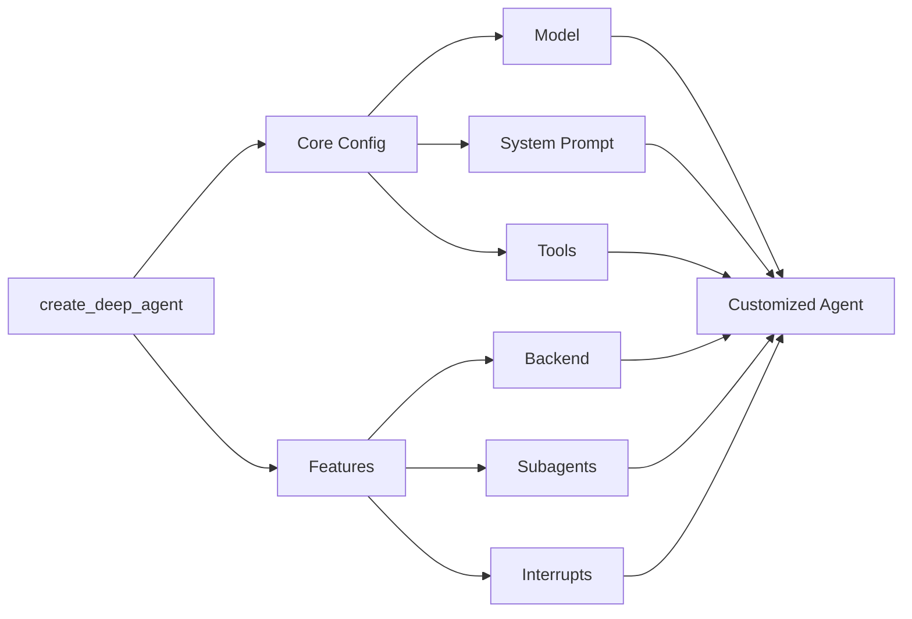

## Model

By default, `deepagents` uses [`claude-sonnet-4-5-20250929`](https://platform.claude.com/docs/en/about-claude/models/overview). You can customize the model used by passing any supported <Tooltip tip="A string that follows the format `provider:model` (e.g. openai:gpt-5)" cta="See mappings" href="https://reference.langchain.com/python/langchain/models/#langchain.chat_models.init_chat_model(model)">model identifier string</Tooltip> or [LangChain model object](/oss/javascript/integrations/chat).

<Tip>
    Use the `provider:model` format (e.g., `openai:gpt-5`) to quickly switch between models.
</Tip>


```typescript
import { ChatAnthropic } from "@langchain/anthropic";
import { ChatOpenAI } from "@langchain/openai";
import { createDeepAgent } from "deepagents";

// Using Anthropic
const agent = createDeepAgent({
  model: new ChatAnthropic({
    model: "claude-sonnet-4-20250514",
    temperature: 0,
  }),
});

// Using OpenAI
const agent2 = createDeepAgent({
  model: new ChatOpenAI({
    model: "gpt-5",
    temperature: 0,
  }),
});
```


## System prompt

Deep agents come with a built-in system prompt inspired by Claude Code's system prompt. The default system prompt contains detailed instructions for using the built-in planning tool, file system tools, and subagents.

Each deep agent tailored to a use case should include a custom system prompt specific to that use case.


```typescript
import { createDeepAgent } from "deepagents";

const researchInstructions = `You are an expert researcher. Your job is to conduct thorough research, and then write a polished report.`;

const agent = createDeepAgent({
  systemPrompt: researchInstructions,
});
```


## Tools

In addition to custom tools you provide, deep agents include [built-in tools](/oss/javascript/deepagents/overview#core-capabilities) for planning, file management, and subagent spawning.


```typescript
import { tool } from "langchain";
import { TavilySearch } from "@langchain/tavily";
import { createDeepAgent } from "deepagents";
import { z } from "zod";

const internetSearch = tool(
  async ({
    query,
    maxResults = 5,
    topic = "general",
    includeRawContent = false,
  }: {
    query: string;
    maxResults?: number;
    topic?: "general" | "news" | "finance";
    includeRawContent?: boolean;
  }) => {
    const tavilySearch = new TavilySearch({
      maxResults,
      tavilyApiKey: process.env.TAVILY_API_KEY,
      includeRawContent,
      topic,
    });
    return await tavilySearch._call({ query });
  },
  {
    name: "internet_search",
    description: "Run a web search",
    schema: z.object({
      query: z.string().describe("The search query"),
      maxResults: z.number().optional().default(5),
      topic: z
        .enum(["general", "news", "finance"])
        .optional()
        .default("general"),
      includeRawContent: z.boolean().optional().default(false),
    }),
  },
);

const agent = createDeepAgent({
  tools: [internetSearch],
});
```

---

<Callout icon="pen-to-square" iconType="regular">
    [Edit this page on GitHub](https://github.com/langchain-ai/docs/edit/main/src/oss/deepagents/customization.mdx) or [file an issue](https://github.com/langchain-ai/docs/issues/new/choose).
</Callout>
<Tip icon="terminal" iconType="regular">
    [Connect these docs](/use-these-docs) to Claude, VSCode, and more via MCP for real-time answers.
</Tip>
