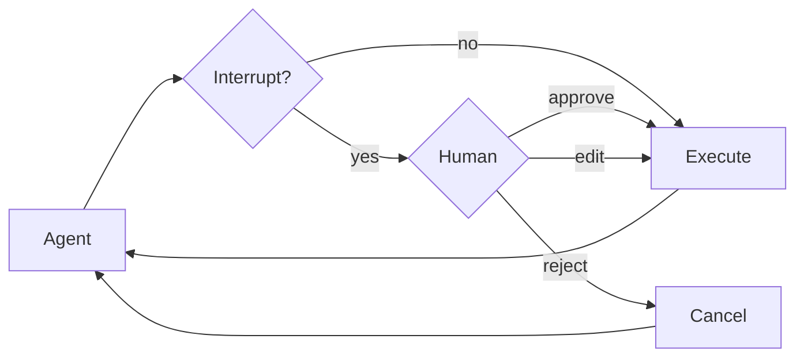

Some tool operations may be sensitive and require human approval before execution. Deep agents support human-in-the-loop workflows through LangGraph's interrupt capabilities. You can configure which tools require approval using the `interrupt_on` parameter.



## Basic configuration

The `interrupt_on` parameter accepts a dictionary mapping tool names to interrupt configurations. Each tool can be configured with:

- **`True`**: Enable interrupts with default behavior (approve, edit, reject allowed)
- **`False`**: Disable interrupts for this tool
- **`{"allowed_decisions": [...]}`**: Custom configuration with specific allowed decisions


```typescript
import { tool } from "langchain";
import { createDeepAgent } from "deepagents";
import { MemorySaver } from "@langchain/langgraph";
import { z } from "zod";
import { v4 as uuidv4 } from 'uuid'; // install uuid package: npm install uuid

const deleteFile = tool(
  async ({ path }: { path: string }) => {
    return `Deleted ${path}`;
  },
  {
    name: "delete_file",
    description: "Delete a file from the filesystem.",
    schema: z.object({
      path: z.string(),
    }),
  },
);

const sendEmail = tool(
  async ({ to, subject, body }: { to: string; subject: string; body: string }) => {
    return `Sent email to ${to}`;
  },
  {
    name: "send_email",
    description: "Send an email.",
    schema: z.object({
      to: z.string(),
      subject: z.string(),
      body: z.string(),
    }),
  },
);

// Checkpointer is REQUIRED for human-in-the-loop
const checkpointer = new MemorySaver();

const agent = createDeepAgent({
  model: "claude-sonnet-4-5-20250929",
  tools: [deleteFile, sendEmail],
  interruptOn: {
    delete_file: true,  // Default: approve, edit, reject
    read_file: false,   // No interrupts needed
    send_email: { allowedDecisions: ["approve", "reject"] },  // No editing
  },
  checkpointer,  // Required!
});
```


## Decision types

The `allowed_decisions` list controls what actions a human can take when reviewing a tool call:

- **`"approve"`**: Execute the tool with the original arguments as proposed by the agent
- **`"edit"`**: Modify the tool arguments before execution
- **`"reject"`**: Skip executing this tool call entirely

You can customize which decisions are available for each tool:


```typescript
const interruptOn = {
  // Sensitive operations: allow all options
  delete_file: { allowedDecisions: ["approve", "edit", "reject"] },

  // Moderate risk: approval or rejection only
  write_file: { allowedDecisions: ["approve", "reject"] },

  // Must approve (no rejection allowed)
  critical_operation: { allowedDecisions: ["approve"] },
};
```


## Handle interrupts

When an interrupt is triggered, the agent pauses execution and returns control. Check for interrupts in the result and handle them accordingly.


```typescript
import { v4 as uuidv4 } from "uuid";
import { Command } from "@langchain/langgraph";

// Create config with thread_id for state persistence
const config = { configurable: { thread_id: uuidv4() } };

// Invoke the agent
let result = await agent.invoke({
  messages: [{ role: "user", content: "Delete the file temp.txt" }],
}, config);

// Check if execution was interrupted
if (result.__interrupt__) {
  // Extract interrupt information
  const interrupts = result.__interrupt__[0].value;
  const actionRequests = interrupts.actionRequests;
  const reviewConfigs = interrupts.reviewConfigs;

  // Create a lookup map from tool name to review config
  const configMap = Object.fromEntries(
    reviewConfigs.map((cfg) => [cfg.actionName, cfg])
  );

  // Display the pending actions to the user
  for (const action of actionRequests) {
    const reviewConfig = configMap[action.name];
    console.log(`Tool: ${action.name}`);
    console.log(`Arguments: ${JSON.stringify(action.args)}`);
    console.log(`Allowed decisions: ${reviewConfig.allowedDecisions}`);
  }

  // Get user decisions (one per actionRequest, in order)
  const decisions = [
    { type: "approve" }  // User approved the deletion
  ];

  // Resume execution with decisions
  result = await agent.invoke(
    new Command({ resume: { decisions } }),
    config  // Must use the same config!
  );
}

// Process final result
console.log(result.messages[result.messages.length - 1].content);
```


## Multiple tool calls

When the agent calls multiple tools that require approval, all interrupts are batched together in a single interrupt. You must provide decisions for each one in order.


```typescript
const config = { configurable: { thread_id: uuidv4() } };

let result = await agent.invoke({
  messages: [{
    role: "user",
    content: "Delete temp.txt and send an email to admin@example.com"
  }]
}, config);

if (result.__interrupt__) {
  const interrupts = result.__interrupt__[0].value;
  const actionRequests = interrupts.actionRequests;

  // Two tools need approval
  console.assert(actionRequests.length === 2);

  // Provide decisions in the same order as actionRequests
  const decisions = [
    { type: "approve" },  // First tool: delete_file
    { type: "reject" }    // Second tool: send_email
  ];

  result = await agent.invoke(
    new Command({ resume: { decisions } }),
    config
  );
}
```


## Edit tool arguments

When `"edit"` is in the allowed decisions, you can modify the tool arguments before execution:


```typescript
if (result.__interrupt__) {
  const interrupts = result.__interrupt__[0].value;
  const actionRequest = interrupts.actionRequests[0];

  // Original args from the agent
  console.log(actionRequest.args);  // { to: "everyone@company.com", ... }

  // User decides to edit the recipient
  const decisions = [{
    type: "edit",
    editedAction: {
      name: actionRequest.name,  // Must include the tool name
      args: { to: "team@company.com", subject: "...", body: "..." }
    }
  }];

  result = await agent.invoke(
    new Command({ resume: { decisions } }),
    config
  );
}
```


## Subagent interrupts

Each subagent can have its own `interrupt_on` configuration that overrides the main agent's settings:


```typescript
const agent = createDeepAgent({
  tools: [deleteFile, readFile],
  interruptOn: {
    delete_file: true,
    read_file: false,
  },
  subagents: [{
    name: "file-manager",
    description: "Manages file operations",
    systemPrompt: "You are a file management assistant.",
    tools: [deleteFile, readFile],
    interruptOn: {
      // Override: require approval for reads in this subagent
      delete_file: true,
      read_file: true,  // Different from main agent!
    }
  }],
  checkpointer
});
```


When a subagent triggers an interrupt, the handling is the same – check for `__interrupt__` and resume with `Command`.

## Best practices

### Always use a checkpointer

Human-in-the-loop requires a checkpointer to persist agent state between the interrupt and resume:


### Use the same thread ID

When resuming, you must use the same config with the same `thread_id`:


### Match decision order to actions

The decisions list must match the order of `action_requests`:


### Tailor configurations by risk

Configure different tools based on their risk level:

---

<Callout icon="pen-to-square" iconType="regular">
    [Edit this page on GitHub](https://github.com/langchain-ai/docs/edit/main/src/oss/deepagents/human-in-the-loop.mdx) or [file an issue](https://github.com/langchain-ai/docs/issues/new/choose).
</Callout>
<Tip icon="terminal" iconType="regular">
    [Connect these docs](/use-these-docs) to Claude, VSCode, and more via MCP for real-time answers.
</Tip>
