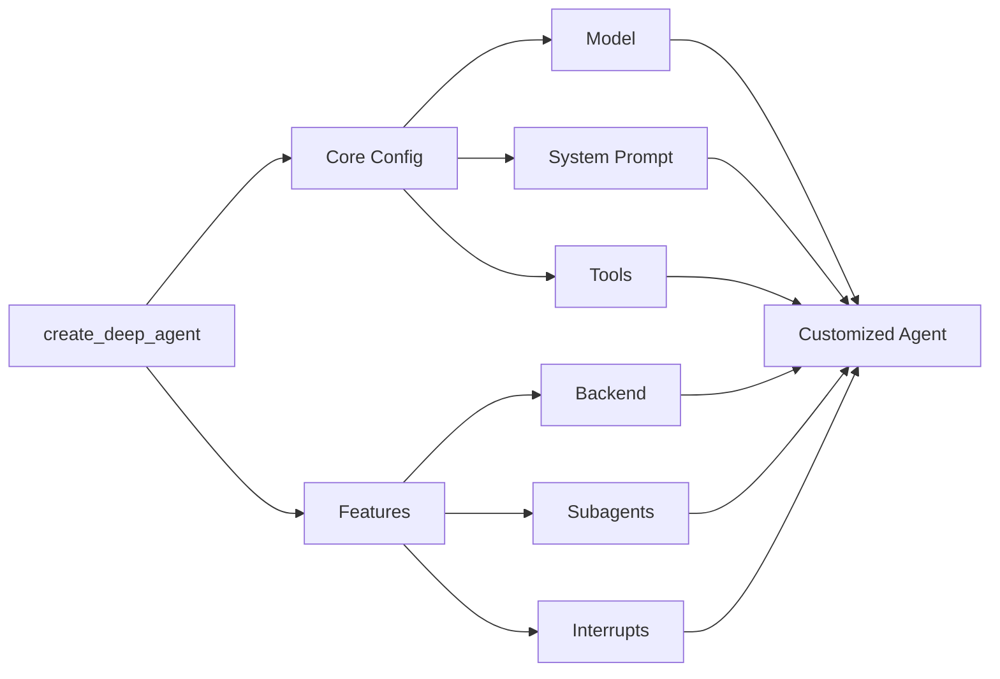

## Model

By default, `deepagents` uses [`claude-sonnet-4-5-20250929`](https://platform.claude.com/docs/en/about-claude/models/overview). You can customize the model used by passing any supported <Tooltip tip="A string that follows the format `provider:model` (e.g. openai:gpt-5)" cta="See mappings" href="https://reference.langchain.com/python/langchain/models/#langchain.chat_models.init_chat_model(model)">model identifier string</Tooltip> or [LangChain model object](/oss/python/integrations/chat).

<Tip>
    Use the `provider:model` format (e.g., `openai:gpt-5`) to quickly switch between models.
</Tip>

<CodeGroup>
    ```python Model string
    from langchain.chat_models import init_chat_model
    from deepagents import create_deep_agent

    model = init_chat_model(model="openai:gpt-5")
    agent = create_deep_agent(model=model)
    ```

    ```python LangChain model object
    # ollama pull llama3.1
    from langchain_ollama import ChatOllama
    from langchain.chat_models import init_chat_model
    from deepagents import create_deep_agent

    model = init_chat_model(
        model=ChatOllama(
            model="llama3.1",
            temperature=0,
            # other params...
        )
    )
    agent = create_deep_agent(model=model)
    ```
</CodeGroup>


## System prompt

Deep agents come with a built-in system prompt inspired by Claude Code's system prompt. The default system prompt contains detailed instructions for using the built-in planning tool, file system tools, and subagents.

Each deep agent tailored to a use case should include a custom system prompt specific to that use case.

```python
from deepagents import create_deep_agent

research_instructions = """\
You are an expert researcher. Your job is to conduct \
thorough research, and then write a polished report. \
"""

agent = create_deep_agent(
    system_prompt=research_instructions,
)
```


## Tools

In addition to custom tools you provide, deep agents include [built-in tools](/oss/python/deepagents/overview#core-capabilities) for planning, file management, and subagent spawning.

```python
import os
from typing import Literal
from tavily import TavilyClient
from deepagents import create_deep_agent

tavily_client = TavilyClient(api_key=os.environ["TAVILY_API_KEY"])

def internet_search(
    query: str,
    max_results: int = 5,
    topic: Literal["general", "news", "finance"] = "general",
    include_raw_content: bool = False,
):
    """Run a web search"""
    return tavily_client.search(
        query,
        max_results=max_results,
        include_raw_content=include_raw_content,
        topic=topic,
    )

agent = create_deep_agent(
    tools=[internet_search]
)
```

---

<Callout icon="pen-to-square" iconType="regular">
    [Edit this page on GitHub](https://github.com/langchain-ai/docs/edit/main/src/oss/deepagents/customization.mdx) or [file an issue](https://github.com/langchain-ai/docs/issues/new/choose).
</Callout>
<Tip icon="terminal" iconType="regular">
    [Connect these docs](/use-these-docs) to Claude, VSCode, and more via MCP for real-time answers.
</Tip>
