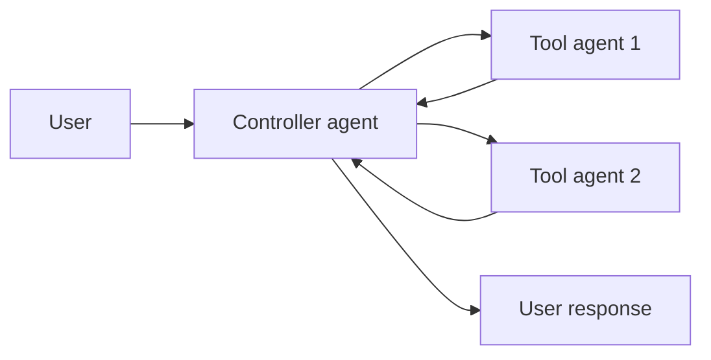
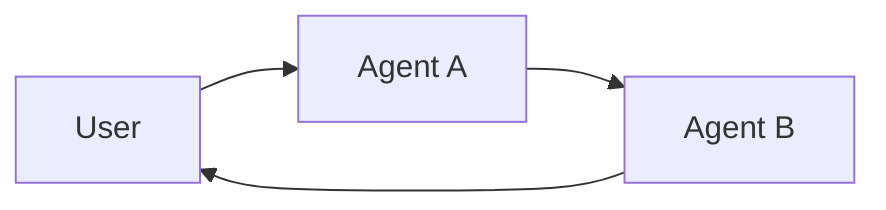

**Multi-agent systems** break a complex application into multiple specialized agents that work together to solve problems.
Instead of relying on a single agent to handle every step, **multi-agent architectures** allow you to compose smaller, focused agents into a coordinated workflow.

Multi-agent systems are useful when:

* A single agent has too many [tools](/oss/langchain/tools) and makes poor decisions about which to use.
* [Context](/oss/concepts/context) or [memory](/oss/langchain/short-term-memory) grows too large for one agent to track effectively.
* Tasks require **specialization** (e.g., a planner, researcher, math expert).

## Multi-agent patterns

Multi-agent systems enable you to build sophisticated applications by combining specialized agents. There are two main patterns:

| Pattern                           | How it works                                                                                                                                                     | Control flow                                               | Example use case                                 |
|-----------------------------------|------------------------------------------------------------------------------------------------------------------------------------------------------------------|------------------------------------------------------------|--------------------------------------------------|
| [**Tool calling**](#tool-calling) | A **supervisor** agent calls other agents as *tools*. The “tool” agents don’t talk to the user directly — they just run their task and return results.                  | **Centralized**: all routing passes through the calling agent. | Task orchestration, structured workflows        |
| [**Handoffs**](#handoffs)         | The current agent decides to **transfer control** to another agent. The active agent changes, and the user may continue interacting directly with the new agent. | **Decentralized**: agents can change who is active.            | Multi-domain conversations, specialist takeover |

<Tip>
    You can mix both patterns! Use **handoffs** for agent switching and have each agent **call sub-agents as tools** for specialized tasks.
</Tip>

### Tool calling

In tool calling, one agent (the **controller**) treats other agents as *tools* to be invoked when needed. The controller manages orchestration, while tool agents perform specific tasks and return results. For example:

1. The **controller** receives input and decides which tool (sub-agent) to call.
2. The **tool agent** runs its task based on the controller's instructions.
3. The **tool agent** returns results to the controller.
4. The **controller** decides the next step or finishes.




<Tip>
    Agents used as tools are generally **not expected** to continue the conversation with the user. Their role is to perform a task and return results to the controller agent. If you need sub-agents to be able to converse with the user, use [handoffs](#handoffs) instead.
</Tip>

#### When to use tool calling

**Use tool calling (supervisor pattern)** when:

* You have multiple distinct domains (e.g., calendar, email, CRM, database).
* Each domain has multiple tools or complex logic.
* You want centralized workflow control.
* Sub-agents don't need to converse directly with users.

For simpler cases with just a few tools, use a single agent. Below are some examples of how you can build multi-agent systems using tool calling:

- **Personal assistant**: A main agent coordinates calendar, email, and task management sub-agents
    - Calendar sub-agent handles scheduling and availability checks
    - Email sub-agent drafts, sends, and searches messages
    - Task sub-agent manages to-do lists and reminders

- **Research assistant**: A supervisor orchestrates research across multiple domains
    - Web search sub-agent finds relevant sources
    - Document analysis sub-agent extracts key information
    - Synthesis sub-agent combines findings into coherent reports

- **Data analysis platform**: One agent routes queries to specialized analyzers
    - SQL sub-agent queries databases
    - Python sub-agent runs statistical analysis
    - Visualization sub-agent creates charts and graphs

<Card
    title="Tutorial: Build a supervisor agent"
    icon="sitemap"
    href="/oss/langchain/supervisor"
    arrow cta="Learn more"
>
    Learn how to build a personal assistant using the supervisor pattern, where a central supervisor agent coordinates specialized worker agents.
</Card>


#### Example

The example below shows how a main agent is given access to a single sub-agent via a tool definition:

:::python
```python
from langchain.tools import tool
from langchain.agents import create_agent


subagent1 = create_agent(model="...", tools=[...])

@tool(
    "subagent1_name",
    description="subagent1_description"
)
def call_subagent1(query: str):
    result = subagent1.invoke({
        "messages": [{"role": "user", "content": query}]
    })
    return result["messages"][-1].content

agent = create_agent(model="...", tools=[call_subagent1])
```
:::
:::js
```typescript
import { createAgent, tool } from "langchain";
import * as z from "zod";

const subagent1 = createAgent({...});

const callSubagent1 = tool(
  async ({ query }) => {
    const result = await subagent1.invoke({
      messages: [{ role: "user", content: query }]
    });
    return result.messages.at(-1)?.text;
  },
  {
    name: "subagent1_name",
    description: "subagent1_description",
    schema: z.object({
      query: z.string().describe("The query to to send to subagent1."),
    }),
  }
);

const agent = createAgent({
  model,
  tools: [callSubagent1]
});
```
:::

In this pattern:

1. The main agent invokes `call_subagent1` when it decides the task matches the sub-agent's description.
2. The sub-agent runs independently and returns its result.
3. The main agent receives the result and continues orchestration.

#### Where to customize

There are several points where you can control how context is passed between the main agent and its subagents:

1. **Sub-agent name** (`"subagent1_name"`): This is how the main agent refers to the sub-agent. Since it influences prompting, choose it carefully.
2. **Sub-agent description** (`"subagent1_description"`): This is what the main agent knows about the sub-agent. It directly shapes how the main agent decides when to call it.
3. **[Input to the sub-agent](#control-the-input-to-the-sub-agent)**: You can customize this input to better shape how the sub-agent interprets tasks. In the example above, we pass the agent-generated `query` directly.
4. **[Output from the sub-agent](#control-the-output-from-the-sub-agent)**: This is the response passed back to the main agent. You can adjust what is returned to control how the main agent interprets results. In the example above, we return the final message text, but you could return additional state or metadata.

##### Control the input to the sub-agent

There are two main levers to control the input that the main agent passes to a sub-agent:

* **Modify the prompt**: Adjust the main agent's prompt or the tool metadata (i.e., sub-agent's name and description) to better guide when and how it calls the sub-agent.
* **Context injection**: Add input that isn't practical to capture in a static prompt (e.g., full message history, prior results, task metadata) by adjusting the tool call to pull from the agent's state.

:::python
```python
from langchain.agents import AgentState
from langchain.tools import tool, ToolRuntime

class CustomState(AgentState):
    example_state_key: str

@tool(
    "subagent1_name",
    description="subagent1_description"
)
def call_subagent1(query: str, runtime: ToolRuntime[None, CustomState]):
    # Apply any logic needed to transform the messages into a suitable input
    subagent_input = some_logic(query, runtime.state["messages"])
    result = subagent1.invoke({
        "messages": subagent_input,
        # You could also pass other state keys here as needed.
        # Make sure to define these in both the main and subagent's
        # state schemas.
        "example_state_key": runtime.state["example_state_key"]
    })
    return result["messages"][-1].content
```
:::
:::js
```typescript
import { createAgent, tool, AgentState, ToolMessage } from "langchain";
import { Command } from "@langchain/langgraph";
import * as z from "zod";

// Example of passing the full conversation history to the sub agent via the state.
const callSubagent1 = tool(
  async ({query}) => {
    const state = getCurrentTaskInput<AgentState>();
    // Apply any logic needed to transform the messages into a suitable input
    const subAgentInput = someLogic(query, state.messages);
    const result = await subagent1.invoke({
      messages: subAgentInput,
      // You could also pass other state keys here as needed.
      // Make sure to define these in both the main and subagent's
      // state schemas.
      exampleStateKey: state.exampleStateKey
    });
    return result.messages.at(-1)?.content;
  },
  {
    name: "subagent1_name",
    description: "subagent1_description",
  }
);
```
:::

##### Control the output from the sub-agent

Two common strategies for shaping what the main agent receives back from a sub-agent:

* **Modify the prompt**: Refine the sub-agent's prompt to specify exactly what should be returned.
  * Useful when outputs are incomplete, too verbose, or missing key details.
  * A common failure mode is that the sub-agent performs tool calls or reasoning but does **not include the results** in its final message. Remind it that the controller (and user) only see the final output, so all relevant info must be included there.
* **Custom output formatting**: Adjust or enrich the sub-agent's response in code before handing it back to the main agent.
  * Example: pass specific state keys back to the main agent in addition to the final text.
  * This requires wrapping the result in a @[`Command`] (or equivalent structure) so you can merge custom state with the sub-agent's response.

:::python
```python
from typing import Annotated
from langchain.agents import AgentState
from langchain.tools import InjectedToolCallId
from langgraph.types import Command


@tool(
    "subagent1_name",
    description="subagent1_description"
)
# We need to pass the `tool_call_id` to the sub agent so it can use it to respond with the tool call result
def call_subagent1(
    query: str,
    tool_call_id: Annotated[str, InjectedToolCallId],
# You need to return a `Command` object to include more than just a final tool call
) -> Command:
    result = subagent1.invoke({
        "messages": [{"role": "user", "content": query}]
    })
    return Command(update={
        # This is the example state key we are passing back
        "example_state_key": result["example_state_key"],
        "messages": [
            ToolMessage(
                content=result["messages"][-1].content,
                # We need to include the tool call id so it matches up with the right tool call
                tool_call_id=tool_call_id
            )
        ]
    })
```
:::
:::js
```typescript
import { tool, ToolMessage } from "langchain";
import { Command } from "@langchain/langgraph";
import * as z from "zod";

const callSubagent1 = tool(
  async ({ query }, config) => {
    const result = await subagent1.invoke({
      messages: [{ role: "user", content: query }]
    });

    // Return a Command to update multiple state keys
    return new Command({
      update: {
        // Pass back additional state from the subagent
        exampleStateKey: result.exampleStateKey,
        messages: [
          new ToolMessage({
            content: result.messages.at(-1)?.text,
            tool_call_id: config.toolCall?.id!
          })
        ]
      }
    });
  },
  {
    name: "subagent1_name",
    description: "subagent1_description",
    schema: z.object({
      query: z.string().describe("The query to send to subagent1")
    })
  }
);
```
:::


### Handoffs

In **handoffs**, agents pass control to each other through **state transitions**. Think of it as a state machine where the system tracks which agent is currently active, and that agent's configuration (system prompt, tools, etc.) determines the behavior. For example:

1. The **current agent** decides it needs to transfer control to another agent.
2. It updates a state variable (e.g., `active_agent`) using a tool that modifies the graph state.
3. On the next conversational turn, the graph reads this state and configures itself with the **new agent's** system prompt, tools, and behavior.
4. The **new agent** interacts directly with the user until it decides to hand off again or finish.



#### When to use handoffs

Handoffs are particularly valuable for **"online"** customer support scenarios where you need to collect information from users in a specific sequence. For example:

* Collecting a warranty ID before processing a refund.
* Gathering account details before escalating to a specialist.
* Verifying identity before accessing sensitive information.

The key advantage is **sequential unlocking** - you can design workflows where additional options or agents become available only after required information has been collected. Below are some examples of how you can build multi-agent systems using handoffs:

- **Customer support chatbot**: Agents pass control based on conversation stage
    - Triage agent collects initial information (warranty status, product details)
    - Classification agent identifies issue type (billing, technical, returns)
    - Resolution agent provides solutions or escalates to human support

- **Multi-domain conversational AI**: Agents hand off when topic changes
    - General conversation agent handles small talk
    - Technical support agent answers product questions
    - Sales agent discusses pricing and purchases

- **Onboarding assistant**: Sequential information collection with branching paths
    - Account setup agent creates credentials
    - Preference collection agent gathers user preferences
    - Tour agent walks through features based on user role

<Card
    title="Tutorial: Build a customer support agent with handoffs"
    icon="people-arrows"
    href="/oss/langchain/customer-support-handoffs"
    arrow cta="Learn more"
>
    Learn how to build a customer support workflow using the handoffs pattern, where agents pass control through state transitions.
</Card>


<Tip>
    Design handoff flows carefully to avoid creating rigid, frustrating experiences. Users should be able to:
    * Correct typos or mistakes in previously provided information.
    * Change the conversation flow when appropriate.
    * Navigate back to previous steps if needed.

    Overly restrictive handoff patterns can feel like poorly designed phone trees.
</Tip>

#### How handoffs work

At the core, handoffs rely on [persistent state](/oss/langchain/short-term-memory) that survives across conversation turns:

1. **State variable**: A field in your state schema (e.g., `active_agent: str`) tracks which agent is currently active.
2. **State update tool**: The agent uses a tool to change the value of `active_agent` when handing off control.
3. **Dynamic configuration**: On each turn, the graph entry point reads `active_agent` from the persisted state and dynamically configures the appropriate system prompt, tools, and behavior for that agent.

This pattern creates a state machine where each agent represents a distinct state with its own behavior and capabilities. The state persists between user messages, allowing the conversation to resume with the correct agent configuration.

#### Example

Here's an example showing how agents hand off control:

:::python
```python
from langchain.agents import AgentState, create_agent
from langchain.tools import tool, ToolRuntime
from langgraph.types import Command

class SupportState(AgentState):
    """Track which agent is currently active."""
    current_agent: str = "triage"

@tool
def transfer_to_specialist(
    runtime: ToolRuntime[None, SupportState]
) -> Command:
    """Transfer conversation to a specialist agent."""
    return Command(update={"current_agent": "specialist"})

# Each agent configuration has different prompts/tools
agent = create_agent(
    model,
    tools=[transfer_to_specialist, ...],
    state_schema=SupportState
)
```
:::
:::js
```typescript
import { tool, createAgent, AgentState } from "langchain";
import { Command } from "@langchain/langgraph";

const SupportState = z.object({
  currentAgent: z.string().default("triage")
});

const transferToSpecialist = tool(
  async (_, config) => {
    return new Command({
      update: { currentAgent: "specialist" }
    });
  },
  {
    name: "transfer_to_specialist",
    description: "Transfer conversation to a specialist",
    schema: z.object({})
  }
);

const agent = createAgent({
  model,
  tools: [transferToSpecialist, ...],
  stateSchema: SupportState
});
```
:::

The key mechanism is using @[`Command`] to update state fields that control which agent is active. Middleware can then read this state and dynamically configure the agent's behavior.

#### Best practices

When implementing handoffs:

1. **Bound message histories**: Use @[`trim_messages`] or @[`@before_model`] [middleware](/oss/langchain/short-term-memory#trim-messages) to prevent unbounded growth.
2. **State for cross-agent memory**: Store structured data (warranty status, issue type) in @[`AgentState`] [custom state](/oss/langchain/short-term-memory#customizing-agent-memory), not message history.
3. **Inject context summaries**: Add state information to system prompts so agents know what previous agents learned.
4. **Validate state transitions**: Check required state exists before allowing transitions to later stages.
5. **Allow backward navigation**: Provide @[`@tool`]s that return @[`Command`] objects for users to correct mistakes and return to previous stages.
6. **Ensure valid message sequences**: Make sure message histories follow provider requirements (user → AI → tool alternation).
7. **Use checkpointers**: Always include a @[`InMemorySaver`] [checkpointer](/oss/langchain/short-term-memory#usage) to persist state across turns.


## Customize agent context

At the center of multi-agent design is **[context engineering](/oss/langchain/context-engineering)** - deciding what information each agent sees. LangChain gives you fine-grained control over:

* Which parts of the conversation or state are passed to each agent.
* Specialized prompts tailored to sub-agents.
* Inclusion/exclusion of intermediate reasoning.
* Customizing input/output formats per agent.

The quality of your system depends on context engineering. The goal is to ensure that each agent has access to the correct data it needs to perform its task, whether it's acting as a tool or as an active agent.
