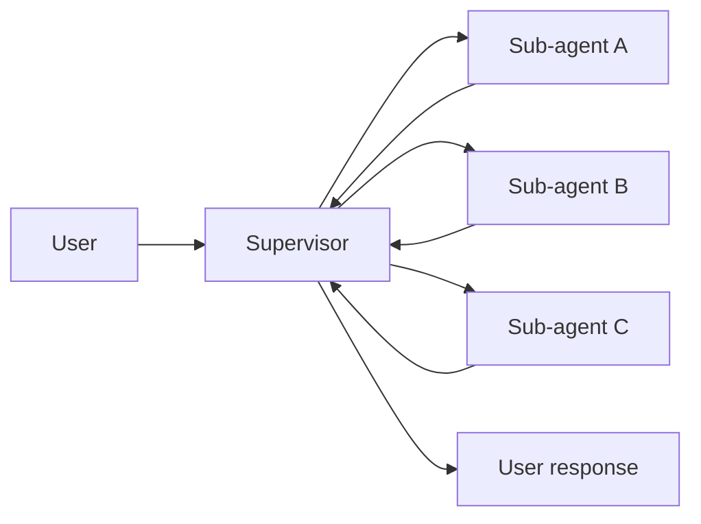
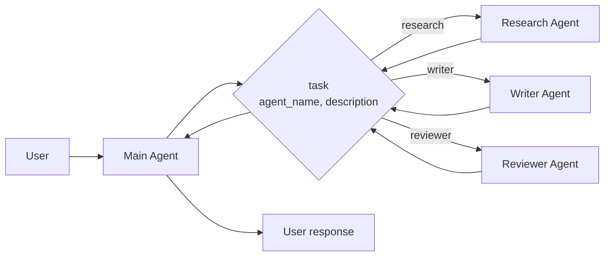
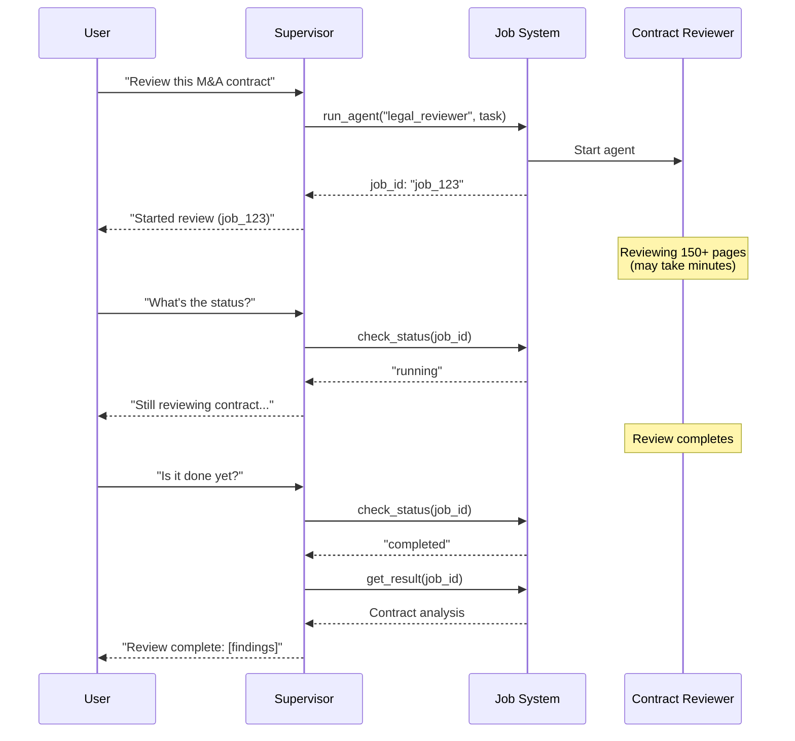
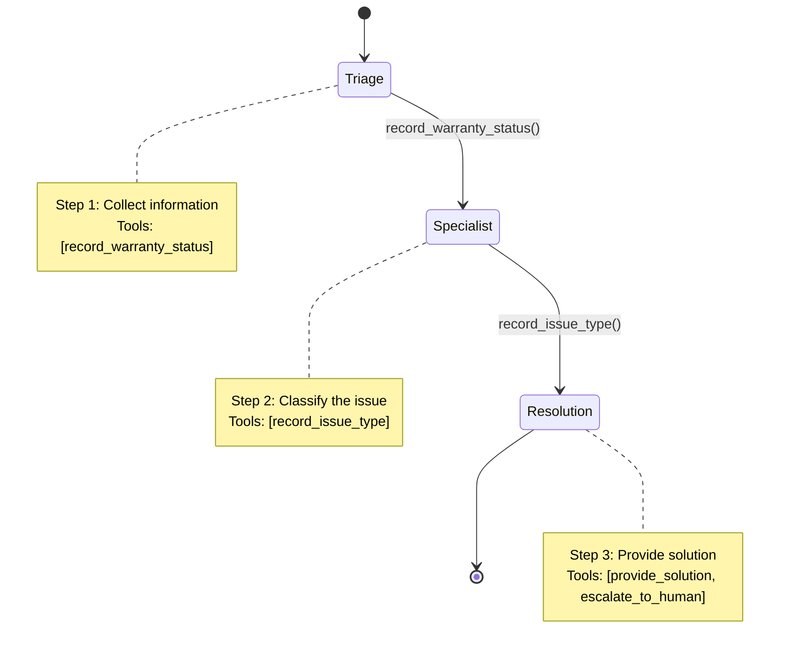
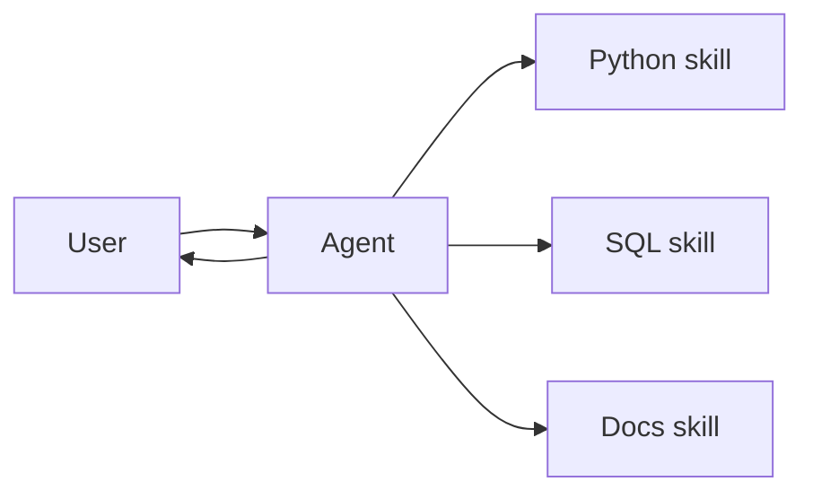
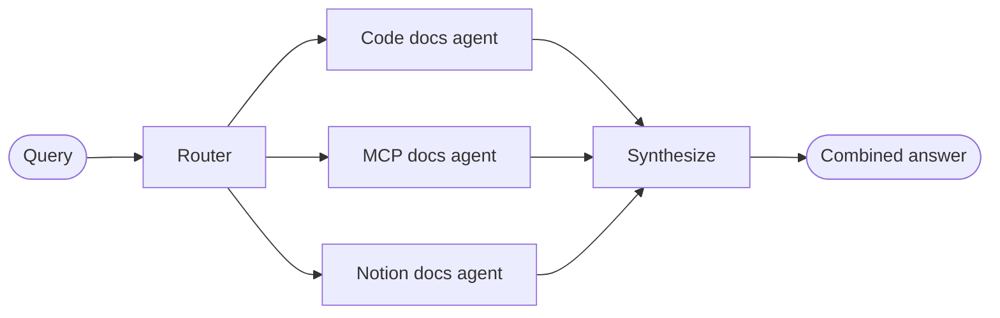
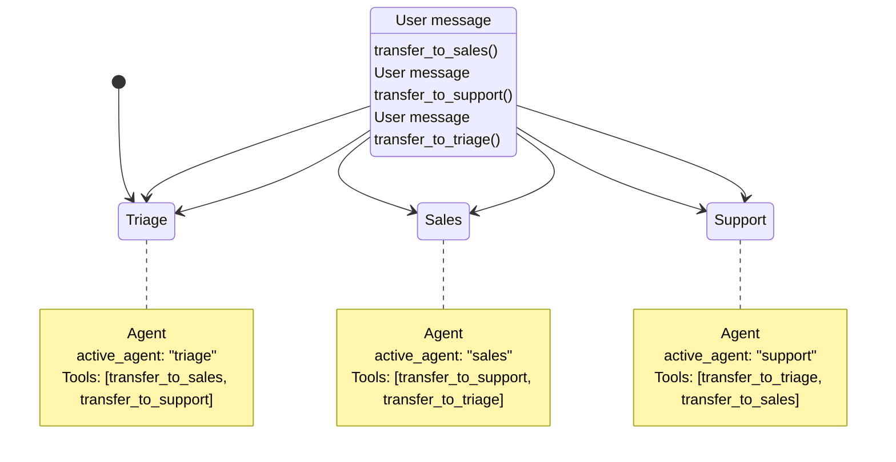
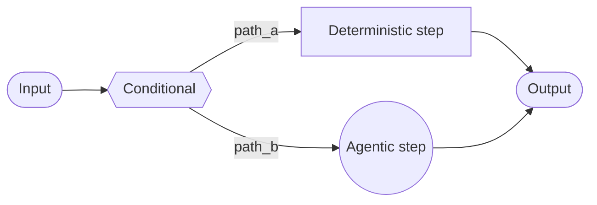
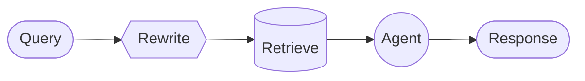

Multi-agent systems break complex applications into coordinated components. **Importantly, "multi-agent" doesn't necessarily mean multiple distinct agents** — a single agent with dynamic behavior can achieve similar capabilities.

## Why multi-agent?

When developers say they need "multi-agent," they're usually looking for one or more of these capabilities:

* **Context management**: Provide specialized knowledge without overwhelming the model's context window. If context were infinite and latency zero, you could dump all knowledge into a single prompt — but since it's not, you need patterns to selectively surface relevant information.
* **Distributed development**: Allow different teams to develop and maintain capabilities independently, composing them into a larger system with clear boundaries and independent testing.
* **Parallelization**: Spawn specialized workers for subtasks and execute them concurrently.

Multi-agent patterns are particularly valuable when a single agent has too many [tools](/oss/langchain/tools) and makes poor decisions about which to use, when tasks require specialized knowledge with extensive context (long prompts and domain-specific tools), or when you need to enforce sequential constraints that unlock capabilities only after certain conditions are met.

## Context engineering

At the center of multi-agent design is **[context engineering](/oss/langchain/context-engineering)** — deciding what information each agent sees. LangChain gives you fine-grained control over which parts of the conversation or state are passed to each agent, specialized prompts tailored to sub-agents, inclusion or exclusion of intermediate reasoning, and customizing input/output formats per agent.

The quality of your system depends on context engineering. The goal is to ensure that each agent has access to the correct data it needs to perform its task, whether it's acting as a tool or as an active agent.

## Patterns

Here are the main patterns for building multi-agent systems, each suited to different use cases:

| Pattern | How it works |
|--------------|--------------|
| [**Supervisor**](#supervisor) | A supervisor agent coordinates sub-agents and background jobs as tools. Centralized control — all routing passes through the supervisor. Multiple coordination approaches available. |
| [**State machine**](#state-machine) | Single agent whose configuration (prompt, tools, capabilities) changes as it moves through different states. Efficient for sequential workflows — one tool call both performs the action and transitions to the next state. |
| [**Skills**](#skills) | Specialized prompts loaded on-demand. The main agent stays in control and gains additional context as needed. |
| [**Router**](#router) | A routing step classifies input and directs it to one or more specialized agents. Results are collected and returned to the user. |
| [**Custom workflow**](#custom-workflow) | Build bespoke logic with LangGraph, mixing deterministic and agentic steps. Reuse or customize agents as needed. |

<Tip>
    You can mix patterns! For example, a **supervisor** can manage **workflow** sub-graphs or use the **router** pattern as a tool (querying multiple knowledge bases in parallel, then synthesizing results). A **state machine** can invoke **skills** at specific stages (loading specialized context only when reaching certain steps). The **[one tool for all agents](#one-tool-for-all-agents-spawning)** approach can work within a **custom workflow** to parallelize independent tasks while maintaining deterministic overall structure.
</Tip>

**Common mechanisms:** These patterns share common mechanisms for coordinating multi-agent behavior. Most rely on **tool calling** as the primary coordination mechanism—tools can invoke sub-agents ([supervisor](#supervisor)), update state to trigger routing or behavior changes ([state machine](#state-machine)), load context on-demand ([skills](#skills)), or even invoke entire multi-agent systems (like wrapping a [router](#router) as a tool).

Tools drive dynamic behavior: updating state to route between agents, loading context, changing configuration, or spawning sub-agents. Patterns can also use middleware to modify system prompts or implement deterministic routing ([custom workflows](#custom-workflow)).

**[Progressive disclosure](/oss/langchain/progressive-disclosure-skills)** loads information on-demand, valuable for managing large amounts of context. It combines retrieval with dynamic state updates (registering tools, discovering sub-agents). However, it adds latency through extra tool calls—simpler patterns like [state machine](#state-machine) suffice when context is manageable or sequential constraints are needed.

## Supervisor

In the **supervisor** architecture, a central supervisor agent coordinates sub-agents by calling them as tools. The supervisor decides which sub-agent to invoke, what input to provide, and how to combine results. Sub-agents are stateless—they don't remember past interactions, with all conversation memory maintained by the supervisor. This provides context isolation: each sub-agent invocation works in a clean context window, preventing context bloat in the main conversation.

**Key characteristics:**

* Centralized control: All routing passes through the supervisor
* No direct user interaction: Sub-agents return results to the supervisor, not the user
* Sub-agents via tools: Sub-agents are invoked via tools
* Parallel execution: The supervisor can invoke multiple sub-agents in a single turn

Use the supervisor pattern when you have multiple distinct domains (e.g., calendar, email, CRM, database), sub-agents don't need to converse directly with users, or you want centralized workflow control. For simpler cases with just a few tools, use a single agent.

<Card
    title="Tutorial: Build a supervisor agent"
    icon="sitemap"
    href="/oss/langchain/supervisor"
    arrow cta="Learn more"
>
    Learn how to build a personal assistant using the supervisor pattern, where a central supervisor agent coordinates specialized worker agents.
</Card>

Main approaches to implementing supervisor coordination:

### One tool per agent



The key idea is wrapping sub-agents as tools that the supervisor can call:

:::python
```python
from langchain.tools import tool
from langchain.agents import create_agent

# Create a sub-agent
subagent = create_agent(model="...", tools=[...])  # [!code highlight]

# Wrap it as a tool  # [!code highlight]
@tool("subagent_name", description="subagent_description")  # [!code highlight]
def call_subagent(query: str):  # [!code highlight]
    result = subagent.invoke({"messages": [{"role": "user", "content": query}]})
    return result["messages"][-1].content

# Supervisor agent with sub-agent as a tool  # [!code highlight]
supervisor = create_agent(model="...", tools=[call_subagent])  # [!code highlight]
```
:::
:::js
```typescript
import { createAgent, tool } from "langchain";
import * as z from "zod";

// Create a sub-agent
const subagent = createAgent({...});  // [!code highlight]

// Wrap it as a tool  // [!code highlight]
const callSubagent = tool(  // [!code highlight]
  async ({ query }) => {  // [!code highlight]
    const result = await subagent.invoke({
      messages: [{ role: "user", content: query }]
    });
    return result.messages.at(-1)?.text;
  },
  {
    name: "subagent_name",
    description: "subagent_description",
    schema: z.object({
      query: z.string().describe("The query to send to subagent")
    })
  }
);

// Supervisor agent with sub-agent as a tool  // [!code highlight]
const supervisor = createAgent({ model, tools: [callSubagent] });  // [!code highlight]
```
:::

The supervisor invokes the sub-agent tool when it decides the task matches the sub-agent's description, receives the result, and continues orchestration.

There are several points where you can control how context is passed between the main agent and its subagents:

1. **Sub-agent name** (`"subagent_name"`): This is how the main agent refers to the sub-agent. Since it influences prompting, choose it carefully.
2. **Sub-agent description** (`"subagent_description"`): This is what the main agent knows about the sub-agent. It directly shapes how the main agent decides when to call it.
3. **Input to the sub-agent**: You can customize this input to better shape how the sub-agent interprets tasks. In the example above, we pass the agent-generated `query` directly.
4. **Output from the sub-agent**: This is the response passed back to the main agent. You can adjust what is returned to control how the main agent interprets results. In the example above, we return the final message text, but you could return additional state or metadata.

<Accordion title="Customizing sub-agent input">

There are two main levers to control the input that the main agent passes to a sub-agent: modifying the prompt (adjust the main agent's prompt or tool metadata to better guide when and how it calls the sub-agent) or context injection (add input that isn't practical to capture in a static prompt, like full message history, prior results, or task metadata, by adjusting the tool call to pull from the agent's state).

:::python
```python
from langchain.agents import AgentState
from langchain.tools import tool, ToolRuntime

class CustomState(AgentState):
    example_state_key: str

@tool(
    "subagent1_name",
    description="subagent1_description"
)
def call_subagent1(query: str, runtime: ToolRuntime[None, CustomState]):
    # Apply any logic needed to transform the messages into a suitable input
    subagent_input = some_logic(query, runtime.state["messages"])
    result = subagent1.invoke({
        "messages": subagent_input,
        # You could also pass other state keys here as needed.
        # Make sure to define these in both the main and subagent's
        # state schemas.
        "example_state_key": runtime.state["example_state_key"]
    })
    return result["messages"][-1].content
```
:::
:::js
```typescript
import { createAgent, tool, AgentState, ToolMessage } from "langchain";
import { Command } from "@langchain/langgraph";
import * as z from "zod";

// Example of passing the full conversation history to the sub agent via the state.
const callSubagent1 = tool(
  async ({query}) => {
    const state = getCurrentTaskInput<AgentState>();
    // Apply any logic needed to transform the messages into a suitable input
    const subAgentInput = someLogic(query, state.messages);
    const result = await subagent1.invoke({
      messages: subAgentInput,
      // You could also pass other state keys here as needed.
      // Make sure to define these in both the main and subagent's
      // state schemas.
      exampleStateKey: state.exampleStateKey
    });
    return result.messages.at(-1)?.content;
  },
  {
    name: "subagent1_name",
    description: "subagent1_description",
  }
);
```
:::

</Accordion>

<Accordion title="Customizing sub-agent output">

Two common strategies for shaping what the main agent receives back from a sub-agent: First, modify the sub-agent's prompt to specify exactly what should be returned—this is useful when outputs are incomplete, too verbose, or missing key details. A common failure mode is that the sub-agent performs tool calls or reasoning but doesn't include the results in its final message; remind it that the controller and user only see the final output, so all relevant info must be included there. Second, adjust or enrich the sub-agent's response in code before handing it back to the main agent—for example, pass specific state keys back in addition to the final text. This requires wrapping the result in a @[`Command`] (or equivalent structure) so you can merge custom state with the sub-agent's response.

:::python
```python
from typing import Annotated
from langchain.agents import AgentState
from langchain.tools import InjectedToolCallId
from langgraph.types import Command


@tool(
    "subagent1_name",
    description="subagent1_description"
)
# We need to pass the `tool_call_id` to the sub agent so it can use it to respond with the tool call result
def call_subagent1(
    query: str,
    tool_call_id: Annotated[str, InjectedToolCallId],
# You need to return a `Command` object to include more than just a final tool call
) -> Command:
    result = subagent1.invoke({
        "messages": [{"role": "user", "content": query}]
    })
    return Command(update={
        # This is the example state key we are passing back
        "example_state_key": result["example_state_key"],
        "messages": [
            ToolMessage(
                content=result["messages"][-1].content,
                # We need to include the tool call id so it matches up with the right tool call
                tool_call_id=tool_call_id
            )
        ]
    })
```
:::
:::js
```typescript
import { tool, ToolMessage } from "langchain";
import { Command } from "@langchain/langgraph";
import * as z from "zod";

const callSubagent1 = tool(
  async ({ query }, config) => {
    const result = await subagent1.invoke({
      messages: [{ role: "user", content: query }]
    });

    // Return a Command to update multiple state keys
    return new Command({
      update: {
        // Pass back additional state from the subagent
        exampleStateKey: result.exampleStateKey,
        messages: [
          new ToolMessage({
            content: result.messages.at(-1)?.text,
            tool_call_id: config.toolCall?.id!
          })
        ]
      }
    });
  },
  {
    name: "subagent1_name",
    description: "subagent1_description",
    schema: z.object({
      query: z.string().describe("The query to send to subagent1")
    })
  }
);
```
:::

</Accordion>


### One tool for all agents

An alternative approach uses a single parameterized tool to spawn ephemeral sub-agents for independent tasks. Unlike the [one tool per agent](#one-tool-per-agent) approach where each sub-agent is wrapped as a separate tool, this uses a convention-based approach with a single `task` tool: the task description is passed as a human message to the sub-agent, and the sub-agent's final message is returned as the tool result.



**Key characteristics:**

* Single task tool: One parameterized tool that can invoke any registered sub-agent by name
* Convention-based invocation: Agent selected by name, task passed as human message, final message returned as tool result
* Team distribution: Different teams can develop and deploy agents independently
* Agent discovery: Sub-agents can be discovered via system prompt (listing available agents) or through [progressive disclosure](/oss/langchain/progressive-disclosure-skills) (loading agent information on-demand via tools)

Use this approach when you want to distribute agent development across multiple teams, need to isolate complex tasks into separate context windows, need a scalable way to add new agents without modifying the coordinator, or prefer convention over customization. This approach trades flexibility in context engineering for simplicity in agent composition and strong context isolation.

<Tip>
An interesting aspect of this approach is that sub-agents may have the exact same capabilities as the main agent. In such cases, spawning a sub-agent is **really about context isolation** as the primary reason—allowing complex, multi-step tasks to run in isolated context windows without bloating the main agent's conversation history. The sub-agent completes its work autonomously and returns only a concise summary, keeping the main thread focused and efficient.
</Tip>

:::python
```python
from langchain.tools import tool
from langchain.agents import create_agent

# Sub-agents developed by different teams
research_agent = create_agent(
    model="gpt-4o",
    prompt="You are a research specialist..."
)

writer_agent = create_agent(
    model="gpt-4o",
    prompt="You are a writing specialist..."
)

# Registry of available sub-agents
SUBAGENTS = {
    "research": research_agent,
    "writer": writer_agent,
}

@tool
def task(
    agent_name: str,
    description: str
) -> str:
    """Launch an ephemeral subagent for a task.

    Available agents:
    - research: Research and fact-finding
    - writer: Content creation and editing
    """
    agent = SUBAGENTS[agent_name]
    result = agent.invoke({
        "messages": [
            {"role": "user", "content": description}
        ]
    })
    return result["messages"][-1].content

# Main coordinator agent
main_agent = create_agent(
    model="gpt-4o",
    tools=[task],
    system_prompt=(
        "You coordinate specialized sub-agents. "
        "Available: research (fact-finding), "
        "writer (content creation). "
        "Use the task tool to delegate work."
    ),
)
```
:::
:::js
```typescript
import { tool, createAgent } from "langchain";
import * as z from "zod";

// Sub-agents developed by different teams
const researchAgent = createAgent({
  model: "gpt-4o",
  prompt: "You are a research specialist...",
});

const writerAgent = createAgent({
  model: "gpt-4o",
  prompt: "You are a writing specialist...",
});

// Registry of available sub-agents
const SUBAGENTS = {
  research: researchAgent,
  writer: writerAgent,
};

const task = tool(
  async ({ agentName, description }) => {
    const agent = SUBAGENTS[agentName];
    const result = await agent.invoke({
      messages: [
        { role: "user", content: description }
      ],
    });
    return result.messages.at(-1)?.content;
  },
  {
    name: "task",
    description: `Launch an ephemeral subagent.

Available agents:
- research: Research and fact-finding
- writer: Content creation and editing`,
    schema: z.object({
      agentName: z
        .string()
        .describe("Name of agent to spawn"),
      description: z
        .string()
        .describe("Task description"),
    }),
  }
);

// Main coordinator agent
const mainAgent = createAgent({
  model: "gpt-4o",
  tools: [task],
  prompt: (
    "You coordinate specialized sub-agents. " +
    "Available: research (fact-finding), " +
    "writer (content creation). " +
    "Use the task tool to delegate work."
  ),
});
```
:::

<Tip>
**One tool per agent vs One tool for all agents**: The [one tool per agent](#one-tool-per-agent) approach wraps each sub-agent as a separate tool with custom input/output handling, giving fine-grained control over context engineering. The one tool for all agents approach uses a single tool with a consistent convention, making it easier to add new agents but harder to customize how each agent receives context.
</Tip>


### Background jobs

Background jobs keep the supervisor responsive during long-running tasks. When work takes minutes—reviewing contracts, conducting research, auditing code—the supervisor kicks off an agent as a background job and continues conversing with the user while the work completes.



**Key characteristics:**

* Three-tool pattern: Kick off job (returns job ID), check status, get results
* Asynchronous execution: Work proceeds in the background while supervisor remains responsive
* User-initiated checks: Supervisor checks job status when the user asks, not on a polling schedule
* Flexible workload: Works for long-running agents or any async computation (database queries, API calls, ML inference)

**Handling job completion:** When a job finishes, your application needs to notify the user. One approach: surface a notification that, when clicked, sends a `HumanMessage` like "Check job_123 and summarize the results." This prompts the supervisor to retrieve and present the findings.


## State machine

In the **state machine** architecture, you have a single agent whose behavior (prompt, tools, and capabilities) changes dynamically based on state. The state machine is implemented via [middleware](/oss/langchain/middleware/overview) that performs transitions through tool calls.



**Key characteristics:**

* State-driven configuration: A single agent whose prompts and tools change dynamically based on a state variable (e.g., `current_step`)
* Direct user interaction: Each step's configuration handles user messages directly
* Persistent state: State survives across conversation turns

<Tip>
**Alternative to handoffs**: This pattern can be more efficient than handoff-based approaches like [OpenAI's agent handoffs](https://openai.github.io/openai-agents-python/handoffs/) or [LangGraph swarm](https://github.com/langchain-ai/langgraph-swarm-py). Depending on implementation, handoffs may require two tool calls (transfer control, then act) while state machines can combine both. Because it's a single agent switching behaviors rather than distinct agents, it's simpler to streamline the tool calls and manage the conversation context correctly.
</Tip>

Use the state machine pattern when you need to enforce sequential constraints (unlock capabilities only after preconditions are met), the agent needs to converse directly with the user across different states, or you're building multi-stage conversational flows. This pattern is particularly valuable for customer support scenarios where you need to collect information in a specific sequence — for example, collecting a warranty ID before processing a refund.

<Card
    title="Tutorial: Build a customer support agent using a state machine"
    icon="people-arrows"
    href="/oss/langchain/customer-support-state-machine"
    arrow cta="Learn more"
>
    Learn how to build a customer support agent using the state machine pattern, where a single agent transitions between different configurations.
</Card>

At the core, the state machine pattern relies on [persistent state](/oss/langchain/short-term-memory) that survives across conversation turns:

1. **State variable**: A field in your state schema (e.g., `current_step: str`) tracks which step is currently active.
2. **State update tool**: The agent uses a tool to change the value of `current_step` when transitioning to the next step.
3. **Dynamic configuration**: On each turn, middleware reads `current_step` from the persisted state and dynamically configures the appropriate system prompt, tools, and behavior.

This pattern creates a state machine where each step represents a distinct state with its own configuration and capabilities.

<Accordion title="Building a state machine with middleware">

:::python
```python
from langchain.agents import AgentState, create_agent
from langchain.agents.middleware import wrap_model_call, ModelRequest, ModelResponse
from langchain.tools import tool, ToolRuntime
from langchain.messages import ToolMessage
from langgraph.types import Command
from typing import Callable

# 1. Define state with current_step tracker
class SupportState(AgentState):  # [!code highlight]
    """Track which step is currently active."""
    current_step: str = "triage"  # [!code highlight]
    warranty_status: str | None = None

# 2. Tools update current_step via Command
@tool
def record_warranty_status(
    status: str,
    runtime: ToolRuntime[None, SupportState]
) -> Command:  # [!code highlight]
    """Record warranty status and transition to next step."""
    return Command(update={  # [!code highlight]
        "messages": [  # [!code highlight]
            ToolMessage(
                content=f"Warranty status recorded: {status}",
                tool_call_id=runtime.tool_call_id
            )
        ],
        "warranty_status": status,
        "current_step": "specialist"  # Transition to next step  # [!code highlight]
    })

# 3. Middleware applies dynamic configuration based on current_step
@wrap_model_call  # [!code highlight]
def apply_step_config(
    request: ModelRequest,
    handler: Callable[[ModelRequest], ModelResponse]
) -> ModelResponse:
    """Configure agent behavior based on current_step."""
    step = request.state.get("current_step", "triage")  # [!code highlight]

    # Map steps to their configurations
    configs = {
        "triage": {
            "prompt": "Collect warranty information...",
            "tools": [record_warranty_status]
        },
        "specialist": {
            "prompt": "Provide solutions based on warranty: {warranty_status}",
            "tools": [provide_solution, escalate]
        }
    }

    config = configs[step]
    request = request.override(  # [!code highlight]
        system_prompt=config["prompt"].format(**request.state),  # [!code highlight]
        tools=config["tools"]  # [!code highlight]
    )
    return handler(request)

# 4. Create agent with middleware
agent = create_agent(
    model,
    tools=[record_warranty_status, provide_solution, escalate],
    state_schema=SupportState,
    middleware=[apply_step_config],  # [!code highlight]
    checkpointer=InMemorySaver()  # Persist state across turns  # [!code highlight]
)
```
:::
:::js
```typescript
import { tool, createAgent, AgentState } from "langchain";
import { wrapModelCall, ModelRequest, ModelResponse } from "langchain/agents/middleware";
import { Command } from "@langchain/langgraph";
import { ToolMessage } from "langchain/messages";
import * as z from "zod";

// 1. Define state with current_step tracker
const SupportState = z.object({  // [!code highlight]
  currentStep: z.string().default("triage"),  // [!code highlight]
  warrantyStatus: z.string().optional()
});

// 2. Tools update currentStep via Command
const recordWarrantyStatus = tool(
  async ({ status }, config) => {
    return new Command({  // [!code highlight]
      update: {  // [!code highlight]
        messages: [  // [!code highlight]
          new ToolMessage({
            content: `Warranty status recorded: ${status}`,
            tool_call_id: config.toolCall?.id!
          })
        ],
        warrantyStatus: status,
        currentStep: "specialist"  // Transition to next step  // [!code highlight]
      }
    });
  },
  {
    name: "record_warranty_status",
    description: "Record warranty status and transition",
    schema: z.object({ status: z.string() })
  }
);

// 3. Middleware applies dynamic configuration based on currentStep
const applyStepConfig = wrapModelCall(  // [!code highlight]
  async (request: ModelRequest, handler) => {
    const step = request.state.currentStep || "triage";  // [!code highlight]

    // Map steps to their configurations
    const configs = {
      triage: {
        prompt: "Collect warranty information...",
        tools: [recordWarrantyStatus]
      },
      specialist: {
        prompt: `Provide solutions based on warranty: ${request.state.warrantyStatus}`,
        tools: [provideSolution, escalate]
      }
    };

    const config = configs[step];
    request = request.override({  // [!code highlight]
      systemPrompt: config.prompt,  // [!code highlight]
      tools: config.tools  // [!code highlight]
    });
    return handler(request);
  }
);

// 4. Create agent with middleware
const agent = createAgent({
  model,
  tools: [recordWarrantyStatus, provideSolution, escalate],
  stateSchema: SupportState,
  middleware: [applyStepConfig],  // [!code highlight]
  checkpointer: new InMemorySaver()  // Persist state across turns  // [!code highlight]
});
```
:::

</Accordion>


## Skills

In the **skills** architecture, specialized capabilities are packaged as invokable "skills" that augment an agent's behavior. Skills are primarily prompt-driven specializations that an agent can invoke on-demand.



**Key characteristics:**

* Prompt-driven specialization: Skills are primarily defined by specialized prompts
* Progressive disclosure: Skills become available based on context or user needs
* Team distribution: Different teams can develop and maintain skills independently
* Lightweight composition: Skills are simpler than full sub-agents

Use the skills pattern when you want a single agent with many possible specializations, you don't need to enforce specific constraints between skills, or different teams need to develop capabilities independently. Common examples include coding assistants (skills for different languages or tasks), knowledge bases (skills for different domains), and creative assistants (skills for different formats).

<Tip>
This pattern is conceptually identical to [llms.txt](https://llmstxt.org/) (introduced by Jeremy Howard), which uses tool calling for progressive disclosure of documentation. The skills pattern applies the same approach to specialized prompts and domain knowledge rather than just documentation pages.
</Tip>

:::python
```python
from langchain.tools import tool
from langchain.agents import create_agent

@tool
def load_skill(skill_name: str) -> str:
    """Load a specialized skill prompt.

    Available skills:
    - write_sql: SQL query writing expert
    - review_legal_doc: Legal document reviewer

    Returns the skill's prompt and context.
    """
    # Load skill content from file/database
    ...

agent = create_agent(
    model="gpt-4o",
    tools=[load_skill],
    system_prompt=(
        "You are a helpful assistant. "
        "You have access to two skills: "
        "write_sql and review_legal_doc. "
        "Use load_skill to access them."
    ),
)
```
:::
:::js
```typescript
import { tool, createAgent } from "langchain";
import * as z from "zod";

const loadSkill = tool(
  async ({ skillName }) => {
    // Load skill content from file/database
    return "";
  },
  {
    name: "load_skill",
    description: `Load a specialized skill.

Available skills:
- write_sql: SQL query writing expert
- review_legal_doc: Legal document reviewer

Returns the skill's prompt and context.`,
    schema: z.object({
      skillName: z
        .string()
        .describe("Name of skill to load")
    })
  }
);

const agent = createAgent({
  model: "gpt-4o",
  tools: [loadSkill],
  prompt: (
    "You are a helpful assistant. " +
    "You have access to two skills: " +
    "write_sql and review_legal_doc. " +
    "Use load_skill to access them."
  ),
});
```
:::

### Extending the pattern

When writing custom implementations, you can extend the basic skills pattern in several ways:

**Dynamic tool registration**: Combine progressive disclosure with state management to register new tools as skills load. For example, loading a "database_admin" skill could both add specialized context and register database-specific tools (backup, restore, migrate). This uses the same tool-and-state mechanisms used across multi-agent patterns—tools updating state to dynamically change agent capabilities.

**Hierarchical skills**: Skills can define other skills in a tree structure, creating nested specializations. For instance, loading a "data_science" skill might make available sub-skills like "pandas_expert", "visualization", and "statistical_analysis". Each sub-skill can be loaded independently as needed, allowing for fine-grained progressive disclosure of domain knowledge. This hierarchical approach helps manage large knowledge bases by organizing capabilities into logical groupings that can be discovered and loaded on-demand.

<Card
    title="Tutorial: Build an agent with on-demand skill loading"
    icon="wand-magic-sparkles"
    href="/oss/langchain/progressive-disclosure-skills"
    arrow cta="Learn more"
>
    Learn how to implement skills with progressive disclosure, where the agent loads specialized prompts and schemas on-demand rather than upfront.
</Card>


## Router

In the **router** architecture, a routing mechanism determines which specialized agents to invoke. This pattern has two distinct approaches: **stateless** and **stateful**.

Main approaches to implementing routing:

### Stateless

In the stateless approach, routing is triggered on every single user input. Each request is independently routed to the appropriate agents, processed, and returned.



**Key characteristics:**

* Router decomposes the query, routes to one or more specialized agents in parallel
* Results are synthesized into a coherent response
* Stateless: best for single-turn requests

This pattern excels at combining expertise from multiple domains. It's best thought of as a stateless API — a tool that takes a query and returns synthesized results. While it could be adapted for conversations (by including past interactions in prompts), a simpler approach is to expose the entire router as a tool that another conversational agent can call.

<Tip>
**Stateless router vs Supervisor**: The [supervisor pattern](#supervisor) can also route to multiple agents. Use the stateless router when you need specialized preprocessing or custom routing logic. Use the supervisor pattern when you want the LLM to decide which agents to call dynamically.
</Tip>

Use the stateless router when you have distinct knowledge domains that need to be queried, questions that benefit from consulting multiple experts, or you want to parallelize search across multiple data sources. Common examples include documentation search across multiple repositories, research assistants querying different knowledge bases, and content retrieval from diverse sources.

<Accordion title="Building a multi-source documentation router">

Your organization's documentation lives in multiple places: code repositories, MCP protocol specifications, and internal Notion pages. When users ask questions like "How do I authenticate API requests?", the answer requires information from all three sources. This example builds a router that decomposes queries, identifies which knowledge bases to consult, queries them in parallel using specialized agents, and synthesizes the results into a comprehensive answer.

:::python
```python
from typing import TypedDict
from langgraph.graph import StateGraph, START, END, Send
from langchain.agents import create_agent
from langchain_openai import ChatOpenAI

class DocsState(TypedDict):
    query: str
    routes: list[str]  # Which knowledge bases to query
    code_docs_result: str | None
    mcp_docs_result: str | None
    notion_docs_result: str | None
    final_answer: str

# Domain expert agents with specialized knowledge
code_docs_agent = create_agent(
    model="openai:gpt-4o",
    prompt="You are a code documentation expert. Answer questions about API references, code examples, and implementation details.",
    name="code_docs"
)

mcp_docs_agent = create_agent(
    model="openai:gpt-4o",
    prompt="You are an MCP (Model Context Protocol) expert. Answer questions about MCP servers, tools, and integrations.",
    name="mcp_docs"
)

notion_docs_agent = create_agent(
    model="openai:gpt-4o",
    prompt="You are a company knowledge expert. Answer questions about internal processes, policies, and team documentation.",
    name="notion_docs"
)

router_llm = ChatOpenAI(model="gpt-4o-mini")

def decompose_query(state: DocsState) -> dict:  # [!code highlight]
    """Decompose query and determine which knowledge bases to consult."""  # [!code highlight]
    response = router_llm.invoke([
        {
            "role": "system",
            "content": "Analyze this query and determine which knowledge bases to consult. Return a JSON list with one or more of: 'code_docs', 'mcp_docs', 'notion_docs'."
        },
        {"role": "user", "content": state["query"]}
    ])
    # Parse LLM response to get routes (simplified for example)
    routes = ["code_docs", "mcp_docs"]  # In practice, parse from LLM response
    return {"routes": routes}

# Route to multiple agents in parallel  # [!code highlight]
def route_to_agents(state: DocsState) -> list[Send]:  # [!code highlight]
    """Fan out to multiple agents in parallel."""  # [!code highlight]
    return [Send(route, state) for route in state["routes"]]  # [!code highlight]

def query_code_docs(state: DocsState) -> dict:
    result = code_docs_agent.invoke({
        "messages": [{"role": "user", "content": state["query"]}]
    })
    return {"code_docs_result": result["messages"][-1].content}

def query_mcp_docs(state: DocsState) -> dict:
    result = mcp_docs_agent.invoke({
        "messages": [{"role": "user", "content": state["query"]}]
    })
    return {"mcp_docs_result": result["messages"][-1].content}

def query_notion_docs(state: DocsState) -> dict:
    result = notion_docs_agent.invoke({
        "messages": [{"role": "user", "content": state["query"]}]
    })
    return {"notion_docs_result": result["messages"][-1].content}

def synthesize_results(state: DocsState) -> dict:  # [!code highlight]
    """Combine results from multiple agents into a coherent answer."""  # [!code highlight]
    results = []
    if state.get("code_docs_result"):
        results.append(f"Code Docs: {state['code_docs_result']}")
    if state.get("mcp_docs_result"):
        results.append(f"MCP Docs: {state['mcp_docs_result']}")
    if state.get("notion_docs_result"):
        results.append(f"Notion: {state['notion_docs_result']}")

    # Use LLM to synthesize
    synthesis_response = router_llm.invoke([
        {"role": "system", "content": "Synthesize these search results into a coherent answer."},
        {"role": "user", "content": "\n\n".join(results)}
    ])
    return {"final_answer": synthesis_response.content}

# Build workflow with parallel execution
workflow = (
    StateGraph(DocsState)
    .add_node("decompose", decompose_query)
    .add_node("code_docs", query_code_docs)
    .add_node("mcp_docs", query_mcp_docs)
    .add_node("notion_docs", query_notion_docs)
    .add_node("synthesize", synthesize_results)
    .add_edge(START, "decompose")
    .add_conditional_edges("decompose", route_to_agents, ["code_docs", "mcp_docs", "notion_docs"])  # [!code highlight]
    .add_edge("code_docs", "synthesize")
    .add_edge("mcp_docs", "synthesize")
    .add_edge("notion_docs", "synthesize")
    .add_edge("synthesize", END)
    .compile()
)

result = workflow.invoke({"query": "How do I use MCP with FastAPI?"})
print(result["final_answer"])
```
:::
:::js
```typescript
import { StateGraph, Annotation, START, END, Send } from "@langchain/langgraph";
import { createAgent } from "langchain";
import { ChatOpenAI } from "@langchain/openai";

const DocsState = Annotation.Root({
  query: Annotation<string>(),
  routes: Annotation<string[]>(),
  codeDocsResult: Annotation<string | null>(),
  mcpDocsResult: Annotation<string | null>(),
  notionDocsResult: Annotation<string | null>(),
  finalAnswer: Annotation<string>()
});

// Domain expert agents with specialized knowledge
const codeDocsAgent = createAgent({
  model: "openai:gpt-4o",
  prompt: "You are a code documentation expert. Answer questions about API references, code examples, and implementation details.",
  name: "code_docs"
});

const mcpDocsAgent = createAgent({
  model: "openai:gpt-4o",
  prompt: "You are an MCP (Model Context Protocol) expert. Answer questions about MCP servers, tools, and integrations.",
  name: "mcp_docs"
});

const notionDocsAgent = createAgent({
  model: "openai:gpt-4o",
  prompt: "You are a company knowledge expert. Answer questions about internal processes, policies, and team documentation.",
  name: "notion_docs"
});

const routerLlm = new ChatOpenAI({ model: "gpt-4o-mini" });

async function decomposeQuery(state: typeof DocsState.State) {  // [!code highlight]
  // Decompose query and determine which knowledge bases to consult  // [!code highlight]
  const response = await routerLlm.invoke([
    {
      role: "system",
      content: "Analyze this query and determine which knowledge bases to consult. Return a JSON list with one or more of: 'code_docs', 'mcp_docs', 'notion_docs'."
    },
    { role: "user", content: state.query }
  ]);
  // Parse LLM response to get routes (simplified for example)
  const routes = ["code_docs", "mcp_docs"];
  return { routes };
}

// Route to multiple agents in parallel  // [!code highlight]
function routeToAgents(state: typeof DocsState.State): Send[] {  // [!code highlight]
  // Fan out to multiple agents in parallel  // [!code highlight]
  return state.routes.map(route => new Send(route, state));  // [!code highlight]
}

async function queryCodeDocs(state: typeof DocsState.State) {
  const result = await codeDocsAgent.invoke({
    messages: [{ role: "user", content: state.query }]
  });
  return { codeDocsResult: result.messages.at(-1)?.content };
}

async function queryMcpDocs(state: typeof DocsState.State) {
  const result = await mcpDocsAgent.invoke({
    messages: [{ role: "user", content: state.query }]
  });
  return { mcpDocsResult: result.messages.at(-1)?.content };
}

async function queryNotionDocs(state: typeof DocsState.State) {
  const result = await notionDocsAgent.invoke({
    messages: [{ role: "user", content: state.query }]
  });
  return { notionDocsResult: result.messages.at(-1)?.content };
}

async function synthesizeResults(state: typeof DocsState.State) {  // [!code highlight]
  // Combine results from multiple agents into a coherent answer  // [!code highlight]
  const results: string[] = [];
  if (state.codeDocsResult) results.push(`Code Docs: ${state.codeDocsResult}`);
  if (state.mcpDocsResult) results.push(`MCP Docs: ${state.mcpDocsResult}`);
  if (state.notionDocsResult) results.push(`Notion: ${state.notionDocsResult}`);

  // Use LLM to synthesize
  const synthesisResponse = await routerLlm.invoke([
    { role: "system", content: "Synthesize these search results into a coherent answer." },
    { role: "user", content: results.join("\n\n") }
  ]);
  return { finalAnswer: synthesisResponse.content };
}

// Build workflow with parallel execution
const workflow = new StateGraph(DocsState)
  .addNode("decompose", decomposeQuery)
  .addNode("code_docs", queryCodeDocs)
  .addNode("mcp_docs", queryMcpDocs)
  .addNode("notion_docs", queryNotionDocs)
  .addNode("synthesize", synthesizeResults)
  .addEdge(START, "decompose")
  .addConditionalEdges("decompose", routeToAgents, ["code_docs", "mcp_docs", "notion_docs"])  // [!code highlight]
  .addEdge("code_docs", "synthesize")
  .addEdge("mcp_docs", "synthesize")
  .addEdge("notion_docs", "synthesize")
  .addEdge("synthesize", END)
  .compile();

const result = await workflow.invoke({ query: "How do I use MCP with FastAPI?" });
console.log(result.finalAnswer);
```
:::

</Accordion>

<Tip>
**Using routers as tools**: The entire router workflow can be exposed as a tool that another agent calls. This is simpler than trying to make the router itself conversational.

:::python
```python
@tool
def search_docs(query: str) -> str:
    """Search across multiple documentation sources."""
    result = workflow.invoke({"query": query})
    return result["final_answer"]

# Now any conversational agent can use this tool
conversational_agent = create_agent(
    model,
    tools=[search_docs],
    prompt="You are a helpful assistant. Use search_docs to answer questions."
)
```
:::
:::js
```typescript
const searchDocs = tool(
  async ({ query }) => {
    const result = await workflow.invoke({ query });
    return result.finalAnswer;
  },
  {
    name: "search_docs",
    description: "Search across multiple documentation sources",
    schema: z.object({
      query: z.string().describe("The search query")
    })
  }
);

// Now any conversational agent can use this tool
const conversationalAgent = createAgent({
  model,
  tools: [searchDocs],
  prompt: "You are a helpful assistant. Use search_docs to answer questions."
});
```
:::
</Tip>


### Stateful (handoffs)

In the stateful approach, agents transfer control to one another using a handoff tool that updates the `active_agent` state variable. On the next user message, the conversation is directed to the currently active agent rather than re-routing from scratch.



**Key characteristics:**

* State-driven routing: The `active_agent` state variable determines which agent handles the next user message
* Tool-based transfers: Agents use handoff tools (e.g., `transfer_to_sales()`) to update the active agent
* Persistent context: The conversation continues with the new agent maintaining state
* Distinct agents: Unlike [state machine](#state-machine), this pattern supports completely different agents with their own prompts, tools, and capabilities

This is how handoffs via tools work in multi-agent systems. It's similar to the [state machine pattern](#state-machine) in that both rely on a state variable to change behavior. However, the state machine pattern uses a single agent whose configuration changes, while stateful routing supports distinct agents with separate implementations.

**Ambiguity in tool semantics:** One challenge with this pattern is potential ambiguity in whether a handoff tool call implements both the action and the transfer of control. For example, if a triage agent calls `transfer_to_sales()`, does it just update the routing state, or should it also perform some action (like creating a sales ticket) before transferring? This requires careful design of tool descriptions and agent prompts to clarify the intended semantics.


## Custom workflow

In the **custom workflow** architecture, you define your own bespoke execution flow using LangGraph. You have complete control over the graph structure—including sequential steps, conditional branches, loops, and parallel execution.

Use custom workflows when:
- Standard patterns (subagents, skills, etc.) don't fit your requirements
- You need to mix deterministic logic with agentic behavior
- Your use case requires complex routing or multi-stage processing

Each node in your workflow can be a simple function, an LLM call, or an entire agent with tools. You can also compose other architectures within a custom workflow—for example, embedding a multi-agent system as a single node.



The [router pattern](#router) is an example of a custom workflow.

<Tip>
**Calling a LangChain agent from a LangGraph node**: The main insight when mixing LangChain and LangGraph is that you can call a LangChain agent directly inside any LangGraph node. This lets you combine the flexibility of custom workflows with the convenience of pre-built agents:

:::python
```python
from langchain.agents import create_agent

agent = create_agent(model="openai:gpt-4o", tools=[...])

def agent_node(state: State) -> dict:
    """A LangGraph node that invokes a LangChain agent."""
    result = agent.invoke({
        "messages": [{"role": "user", "content": state["query"]}]
    })
    return {"answer": result["messages"][-1].content}
```
:::
:::js
```typescript
import { createAgent } from "langchain";

const agent = createAgent({ model: "openai:gpt-4o", tools: [...] });

async function agentNode(state: typeof State.State) {
  // A LangGraph node that invokes a LangChain agent
  const result = await agent.invoke({
    messages: [{ role: "user", content: state.query }]
  });
  return { answer: result.messages.at(-1)?.content };
}
```
:::
</Tip>

**Example: RAG pipeline** — A common use case is combining retrieval with an agent. This example builds a WNBA stats assistant that retrieves from a knowledge base and can fetch live news.

<Accordion title="Custom RAG workflow">

The workflow demonstrates three types of nodes:

- **Model node** (Rewrite): Rewrites the user query for better retrieval using structured output.
- **Deterministic node** (Retrieve): Performs vector similarity search — no LLM involved.
- **Agent node** (Agent): Reasons over retrieved context and can fetch additional information via tools.



<Tip>
You can use LangGraph state to pass information between workflow steps. This allows each part of your workflow to read and update structured fields, making it easy to share data and context across nodes.
</Tip>

:::python
```python
from typing import TypedDict
from pydantic import BaseModel
from langgraph.graph import StateGraph, START, END
from langchain.agents import create_agent
from langchain.tools import tool
from langchain_openai import ChatOpenAI, OpenAIEmbeddings
from langchain_core.vectorstores import InMemoryVectorStore

class State(TypedDict):
    question: str
    rewritten_query: str
    documents: list[str]
    answer: str

# WNBA knowledge base with rosters, game results, and player stats
embeddings = OpenAIEmbeddings()
vector_store = InMemoryVectorStore(embeddings)
vector_store.add_texts([
    # Rosters
    "New York Liberty 2024 roster: Breanna Stewart, Sabrina Ionescu, Jonquel Jones, Courtney Vandersloot.",
    "Las Vegas Aces 2024 roster: A'ja Wilson, Kelsey Plum, Jackie Young, Chelsea Gray.",
    "Indiana Fever 2024 roster: Caitlin Clark, Aliyah Boston, Kelsey Mitchell, NaLyssa Smith.",
    # Game results
    "2024 WNBA Finals: New York Liberty defeated Minnesota Lynx 3-2 to win the championship.",
    "June 15, 2024: Indiana Fever 85, Chicago Sky 79. Caitlin Clark had 23 points and 8 assists.",
    "August 20, 2024: Las Vegas Aces 92, Phoenix Mercury 84. A'ja Wilson scored 35 points.",
    # Player stats
    "A'ja Wilson 2024 season stats: 26.9 PPG, 11.9 RPG, 2.6 BPG. Won MVP award.",
    "Caitlin Clark 2024 rookie stats: 19.2 PPG, 8.4 APG, 5.7 RPG. Won Rookie of the Year.",
    "Breanna Stewart 2024 stats: 20.4 PPG, 8.5 RPG, 3.5 APG.",
])
retriever = vector_store.as_retriever(search_kwargs={"k": 5})

@tool
def get_latest_news(query: str) -> str:
    """Get the latest WNBA news and updates."""
    # Your news API here
    return "Latest: The WNBA announced expanded playoff format for 2025..."

agent = create_agent(
    model="openai:gpt-4o",
    tools=[get_latest_news],
)

model = ChatOpenAI(model="gpt-4o")

class RewrittenQuery(BaseModel):
    query: str

def rewrite_query(state: State) -> dict:
    """Rewrite the user query for better retrieval."""
    system_prompt = """Rewrite this query to retrieve relevant WNBA information.
The knowledge base contains: team rosters, game results with scores, and player statistics (PPG, RPG, APG).
Focus on specific player names, team names, or stat categories mentioned."""
    response = model.with_structured_output(RewrittenQuery).invoke([
        {"role": "system", "content": system_prompt},
        {"role": "user", "content": state["question"]}
    ])
    return {"rewritten_query": response.query}

def retrieve(state: State) -> dict:
    """Retrieve documents based on the rewritten query."""
    docs = retriever.invoke(state["rewritten_query"])
    return {"documents": [doc.page_content for doc in docs]}

def call_agent(state: State) -> dict:
    """Generate answer using retrieved context."""
    context = "\n\n".join(state["documents"])
    prompt = f"Context:\n{context}\n\nQuestion: {state['question']}"
    response = agent.invoke({"messages": [{"role": "user", "content": prompt}]})
    return {"answer": response["messages"][-1].content_blocks}

workflow = (
    StateGraph(State)
    .add_node("rewrite", rewrite_query)
    .add_node("retrieve", retrieve)
    .add_node("agent", call_agent)
    .add_edge(START, "rewrite")
    .add_edge("rewrite", "retrieve")
    .add_edge("retrieve", "agent")
    .add_edge("agent", END)
    .compile()
)

result = workflow.invoke({"question": "Who won the 2024 WNBA Championship?"})
print(result["answer"])
```
:::
:::js
```typescript
import { StateGraph, Annotation, START, END } from "@langchain/langgraph";
import { createAgent, tool } from "langchain";
import { ChatOpenAI, OpenAIEmbeddings } from "@langchain/openai";
import { MemoryVectorStore } from "langchain/vectorstores/memory";
import * as z from "zod";

const State = Annotation.Root({
  question: Annotation<string>(),
  rewrittenQuery: Annotation<string>(),
  documents: Annotation<string[]>(),
  answer: Annotation<string>(),
});

// WNBA knowledge base with rosters, game results, and player stats
const embeddings = new OpenAIEmbeddings();
const vectorStore = await MemoryVectorStore.fromTexts(
  [
    // Rosters
    "New York Liberty 2024 roster: Breanna Stewart, Sabrina Ionescu, Jonquel Jones, Courtney Vandersloot.",
    "Las Vegas Aces 2024 roster: A'ja Wilson, Kelsey Plum, Jackie Young, Chelsea Gray.",
    "Indiana Fever 2024 roster: Caitlin Clark, Aliyah Boston, Kelsey Mitchell, NaLyssa Smith.",
    // Game results
    "2024 WNBA Finals: New York Liberty defeated Minnesota Lynx 3-2 to win the championship.",
    "June 15, 2024: Indiana Fever 85, Chicago Sky 79. Caitlin Clark had 23 points and 8 assists.",
    "August 20, 2024: Las Vegas Aces 92, Phoenix Mercury 84. A'ja Wilson scored 35 points.",
    // Player stats
    "A'ja Wilson 2024 season stats: 26.9 PPG, 11.9 RPG, 2.6 BPG. Won MVP award.",
    "Caitlin Clark 2024 rookie stats: 19.2 PPG, 8.4 APG, 5.7 RPG. Won Rookie of the Year.",
    "Breanna Stewart 2024 stats: 20.4 PPG, 8.5 RPG, 3.5 APG.",
  ],
  [{}, {}, {}, {}, {}, {}, {}, {}, {}],
  embeddings
);
const retriever = vectorStore.asRetriever({ k: 5 });

const getLatestNews = tool(
  async ({ query }) => {
    // Your news API here
    return "Latest: The WNBA announced expanded playoff format for 2025...";
  },
  {
    name: "get_latest_news",
    description: "Get the latest WNBA news and updates",
    schema: z.object({ query: z.string() })
  }
);

const agent = createAgent({
  model: "openai:gpt-4o",
  tools: [getLatestNews],
});

const model = new ChatOpenAI({ model: "gpt-4o" });

const RewrittenQuery = z.object({ query: z.string() });

async function rewriteQuery(state: typeof State.State) {
  const systemPrompt = `Rewrite this query to retrieve relevant WNBA information.
The knowledge base contains: team rosters, game results with scores, and player statistics (PPG, RPG, APG).
Focus on specific player names, team names, or stat categories mentioned.`;
  const response = await model.withStructuredOutput(RewrittenQuery).invoke([
    { role: "system", content: systemPrompt },
    { role: "user", content: state.question }
  ]);
  return { rewrittenQuery: response.query };
}

async function retrieve(state: typeof State.State) {
  const docs = await retriever.invoke(state.rewrittenQuery);
  return { documents: docs.map(doc => doc.pageContent) };
}

async function callAgent(state: typeof State.State) {
  const context = state.documents.join("\n\n");
  const prompt = `Context:\n${context}\n\nQuestion: ${state.question}`;
  const response = await agent.invoke({ messages: [{ role: "user", content: prompt }] });
  return { answer: response.messages.at(-1)?.contentBlocks };
}

const workflow = new StateGraph(State)
  .addNode("rewrite", rewriteQuery)
  .addNode("retrieve", retrieve)
  .addNode("agent", callAgent)
  .addEdge(START, "rewrite")
  .addEdge("rewrite", "retrieve")
  .addEdge("retrieve", "agent")
  .addEdge("agent", END)
  .compile();

const result = await workflow.invoke({ question: "Who won the 2024 WNBA Championship?" });
console.log(result.answer);
```
:::

</Accordion>
