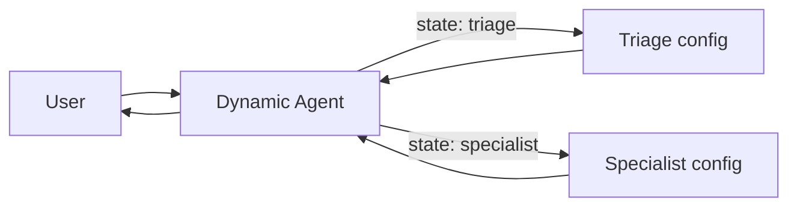
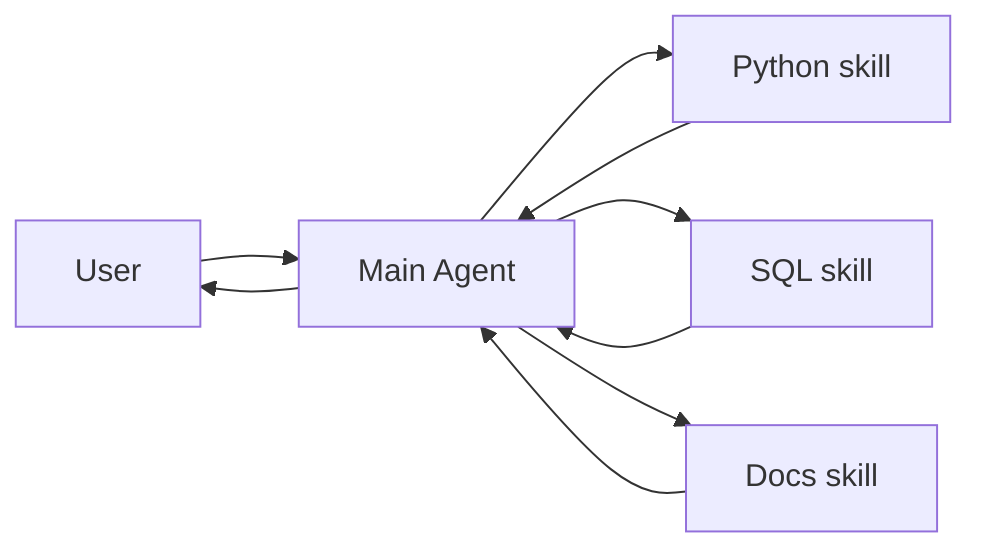

Multi-agent systems break complex applications into coordinated components. **Importantly, "multi-agent" doesn't necessarily mean multiple distinct agents** — a single agent with dynamic behavior can achieve similar capabilities.

When developers say they need "multi-agent," they're usually looking for one or more of these capabilities:

* **Context management**: Provide specialized knowledge without overwhelming the model's context window. If context were infinite and latency zero, you could dump all knowledge into a single prompt — but since it's not, you need patterns to selectively surface relevant information.
* **Distributed development**: Allow different teams to develop and maintain capabilities independently, composing them into a larger system with clear boundaries and independent testing.
* **Parallelization**: Spawn specialized workers for subtasks and execute them concurrently.

## When to use

* A single agent has too many [tools](/oss/langchain/tools) and makes poor decisions about which to use.
* [Context](/oss/concepts/context) or [memory](/oss/langchain/short-term-memory) grows too large for one agent to track effectively.
* Tasks require **specialization** (e.g., a planner, researcher, math expert).
* You need to **enforce sequential constraints** — unlocking capabilities only after certain conditions are met.
* Different teams need to **develop and maintain capabilities independently**.

### Multi-agent context engineering

At the center of multi-agent design is **[context engineering](/oss/langchain/context-engineering)** - deciding what information each agent sees. LangChain gives you fine-grained control over:

* Which parts of the conversation or state are passed to each agent.
* Specialized prompts tailored to sub-agents.
* Inclusion/exclusion of intermediate reasoning.
* Customizing input/output formats per agent.

The quality of your system depends on context engineering. The goal is to ensure that each agent has access to the correct data it needs to perform its task, whether it's acting as a tool or as an active agent.

## Patterns

There are four main patterns for building multi-agent systems, each suited to different use cases:

| Pattern | How it works | Best for |
|--------------|--------------|----------|
| [**Supervisor**](#supervisor) | A central agent calls sub-agents as tools | Task orchestration, parallel execution |
| [**Dynamic agent**](#dynamic-agent) | One agent with dynamically changing prompts/tools based on state | Multi-stage conversations, sequential unlocking |
| [**Skills**](#skills) | Specialized prompts invoked on-demand | Progressive disclosure, team distribution |
| [**Workflow**](#workflow) | Agents connected via deterministic transitions | Pipelines, structured processing |

<Tip>
    You can mix architectures! For example, a **supervisor** can manage **workflow** sub-graphs, or a **dynamic agent** can invoke **skills** at certain stages.
</Tip>

## Supervisor

In the **supervisor** architecture, a central supervisor agent coordinates sub-agents by calling them as tools. The supervisor decides which sub-agent to invoke, what input to provide, and how to combine results.


**Key characteristics:**

* **Centralized control**: All routing passes through the supervisor
* **Sub-agents as tools**: Each sub-agent is wrapped as a callable tool
* **No direct user interaction**: Sub-agents return results to the supervisor, not the user
* **Parallel execution**: The supervisor can invoke multiple sub-agents in a single turn

Use the supervisor pattern when you have **multiple distinct domains** (e.g., calendar, email, CRM, database), sub-agents **don't need to converse directly** with users, or you want **centralized workflow control**. For simpler cases with just a few tools, use a single agent.

<Card
    title="Tutorial: Build a supervisor agent"
    icon="sitemap"
    href="/oss/langchain/supervisor"
    arrow cta="Learn more"
>
    Learn how to build a personal assistant using the supervisor pattern, where a central supervisor agent coordinates specialized worker agents.
</Card>

### Example

The example below shows how a main agent is given access to a single sub-agent via a tool definition:

:::python
```python
from langchain.tools import tool
from langchain.agents import create_agent


subagent1 = create_agent(model="...", tools=[...])

@tool(
    "subagent1_name",
    description="subagent1_description"
)
def call_subagent1(query: str):
    result = subagent1.invoke({
        "messages": [{"role": "user", "content": query}]
    })
    return result["messages"][-1].content

agent = create_agent(model="...", tools=[call_subagent1])
```
:::
:::js
```typescript
import { createAgent, tool } from "langchain";
import * as z from "zod";

const subagent1 = createAgent({...});

const callSubagent1 = tool(
  async ({ query }) => {
    const result = await subagent1.invoke({
      messages: [{ role: "user", content: query }]
    });
    return result.messages.at(-1)?.text;
  },
  {
    name: "subagent1_name",
    description: "subagent1_description",
    schema: z.object({
      query: z.string().describe("The query to to send to subagent1."),
    }),
  }
);

const agent = createAgent({
  model,
  tools: [callSubagent1]
});
```
:::

In this pattern:

1. The main agent invokes `call_subagent1` when it decides the task matches the sub-agent's description.
2. The sub-agent runs independently and returns its result.
3. The main agent receives the result and continues orchestration.

### Where to customize

There are several points where you can control how context is passed between the main agent and its subagents:

1. **Sub-agent name** (`"subagent1_name"`): This is how the main agent refers to the sub-agent. Since it influences prompting, choose it carefully.
2. **Sub-agent description** (`"subagent1_description"`): This is what the main agent knows about the sub-agent. It directly shapes how the main agent decides when to call it.
3. **[Input to the sub-agent](#control-the-input-to-the-sub-agent)**: You can customize this input to better shape how the sub-agent interprets tasks. In the example above, we pass the agent-generated `query` directly.
4. **[Output from the sub-agent](#control-the-output-from-the-sub-agent)**: This is the response passed back to the main agent. You can adjust what is returned to control how the main agent interprets results. In the example above, we return the final message text, but you could return additional state or metadata.

#### Sub-agent input

There are two main levers to control the input that the main agent passes to a sub-agent:

* **Modify the prompt**: Adjust the main agent's prompt or the tool metadata (i.e., sub-agent's name and description) to better guide when and how it calls the sub-agent.
* **Context injection**: Add input that isn't practical to capture in a static prompt (e.g., full message history, prior results, task metadata) by adjusting the tool call to pull from the agent's state.

:::python
```python
from langchain.agents import AgentState
from langchain.tools import tool, ToolRuntime

class CustomState(AgentState):
    example_state_key: str

@tool(
    "subagent1_name",
    description="subagent1_description"
)
def call_subagent1(query: str, runtime: ToolRuntime[None, CustomState]):
    # Apply any logic needed to transform the messages into a suitable input
    subagent_input = some_logic(query, runtime.state["messages"])
    result = subagent1.invoke({
        "messages": subagent_input,
        # You could also pass other state keys here as needed.
        # Make sure to define these in both the main and subagent's
        # state schemas.
        "example_state_key": runtime.state["example_state_key"]
    })
    return result["messages"][-1].content
```
:::
:::js
```typescript
import { createAgent, tool, AgentState, ToolMessage } from "langchain";
import { Command } from "@langchain/langgraph";
import * as z from "zod";

// Example of passing the full conversation history to the sub agent via the state.
const callSubagent1 = tool(
  async ({query}) => {
    const state = getCurrentTaskInput<AgentState>();
    // Apply any logic needed to transform the messages into a suitable input
    const subAgentInput = someLogic(query, state.messages);
    const result = await subagent1.invoke({
      messages: subAgentInput,
      // You could also pass other state keys here as needed.
      // Make sure to define these in both the main and subagent's
      // state schemas.
      exampleStateKey: state.exampleStateKey
    });
    return result.messages.at(-1)?.content;
  },
  {
    name: "subagent1_name",
    description: "subagent1_description",
  }
);
```
:::

#### Sub-agent output

Two common strategies for shaping what the main agent receives back from a sub-agent:

* **Modify the prompt**: Refine the sub-agent's prompt to specify exactly what should be returned.
  * Useful when outputs are incomplete, too verbose, or missing key details.
  * A common failure mode is that the sub-agent performs tool calls or reasoning but does **not include the results** in its final message. Remind it that the controller (and user) only see the final output, so all relevant info must be included there.
* **Custom output formatting**: Adjust or enrich the sub-agent's response in code before handing it back to the main agent.
  * Example: pass specific state keys back to the main agent in addition to the final text.
  * This requires wrapping the result in a @[`Command`] (or equivalent structure) so you can merge custom state with the sub-agent's response.

:::python
```python
from typing import Annotated
from langchain.agents import AgentState
from langchain.tools import InjectedToolCallId
from langgraph.types import Command


@tool(
    "subagent1_name",
    description="subagent1_description"
)
# We need to pass the `tool_call_id` to the sub agent so it can use it to respond with the tool call result
def call_subagent1(
    query: str,
    tool_call_id: Annotated[str, InjectedToolCallId],
# You need to return a `Command` object to include more than just a final tool call
) -> Command:
    result = subagent1.invoke({
        "messages": [{"role": "user", "content": query}]
    })
    return Command(update={
        # This is the example state key we are passing back
        "example_state_key": result["example_state_key"],
        "messages": [
            ToolMessage(
                content=result["messages"][-1].content,
                # We need to include the tool call id so it matches up with the right tool call
                tool_call_id=tool_call_id
            )
        ]
    })
```
:::
:::js
```typescript
import { tool, ToolMessage } from "langchain";
import { Command } from "@langchain/langgraph";
import * as z from "zod";

const callSubagent1 = tool(
  async ({ query }, config) => {
    const result = await subagent1.invoke({
      messages: [{ role: "user", content: query }]
    });

    // Return a Command to update multiple state keys
    return new Command({
      update: {
        // Pass back additional state from the subagent
        exampleStateKey: result.exampleStateKey,
        messages: [
          new ToolMessage({
            content: result.messages.at(-1)?.text,
            tool_call_id: config.toolCall?.id!
          })
        ]
      }
    });
  },
  {
    name: "subagent1_name",
    description: "subagent1_description",
    schema: z.object({
      query: z.string().describe("The query to send to subagent1")
    })
  }
);
```
:::


## Dynamic agent

In the **dynamic agent** architecture, you have a single agent whose behavior (prompt, tools, and capabilities) changes dynamically based on state. Under the hood, this is a state machine implemented via [middleware](/oss/langchain/middleware/overview) that performs handoffs through tool calls.



**Key characteristics:**

* **Single agent, multiple configurations**: The agent identity changes based on state
* **State-driven behavior**: Prompts and tools are selected based on a state variable (e.g., `active_agent`)
* **Direct user interaction**: The active agent configuration handles user messages directly
* **Persistent state**: State survives across conversation turns

Use the dynamic agent pattern when you need to **enforce sequential constraints** (unlock capabilities only after preconditions are met), sub-agents need to **converse directly with the user**, or you're building **multi-stage conversational flows**. This pattern is particularly valuable for customer support scenarios where you need to collect information in a specific sequence — for example, collecting a warranty ID before processing a refund.

<Card
    title="Tutorial: Build a customer support agent with handoffs"
    icon="people-arrows"
    href="/oss/langchain/customer-support-handoffs"
    arrow cta="Learn more"
>
    Learn how to build a customer support workflow using the dynamic agent pattern, where agents pass control through state transitions.
</Card>

<Tip>
    Design dynamic agent flows carefully to avoid creating rigid, frustrating experiences. Users should be able to correct mistakes, change the conversation flow, and navigate back to previous steps. Overly restrictive flows can feel like poorly designed phone trees.
</Tip>

At the core, the dynamic agent pattern relies on [persistent state](/oss/langchain/short-term-memory) that survives across conversation turns:

1. **State variable**: A field in your state schema (e.g., `active_agent: str`) tracks which agent configuration is currently active.
2. **State update tool**: The agent uses a tool to change the value of `active_agent` when transitioning to a new stage.
3. **Dynamic configuration**: On each turn, the graph entry point reads `active_agent` from the persisted state and dynamically configures the appropriate system prompt, tools, and behavior.

This pattern creates a state machine where each configuration represents a distinct state with its own behavior and capabilities.

### Example

Here's an example showing how agents transition between configurations:

:::python
```python
from langchain.agents import AgentState, create_agent
from langchain.tools import tool, ToolRuntime
from langgraph.types import Command

class SupportState(AgentState):
    """Track which agent is currently active."""
    current_agent: str = "triage"

@tool
def transfer_to_specialist(
    runtime: ToolRuntime[None, SupportState]
) -> Command:
    """Transfer conversation to a specialist agent."""
    return Command(update={"current_agent": "specialist"})

# Each agent configuration has different prompts/tools
agent = create_agent(
    model,
    tools=[transfer_to_specialist, ...],
    state_schema=SupportState
)
```
:::
:::js
```typescript
import { tool, createAgent, AgentState } from "langchain";
import { Command } from "@langchain/langgraph";

const SupportState = z.object({
  currentAgent: z.string().default("triage")
});

const transferToSpecialist = tool(
  async (_, config) => {
    return new Command({
      update: { currentAgent: "specialist" }
    });
  },
  {
    name: "transfer_to_specialist",
    description: "Transfer conversation to a specialist",
    schema: z.object({})
  }
);

const agent = createAgent({
  model,
  tools: [transferToSpecialist, ...],
  stateSchema: SupportState
});
```
:::

The key mechanism is using @[`Command`] to update state fields that control which agent configuration is active. Middleware can then read this state and dynamically configure the agent's behavior.


## Workflow

In the **workflow** architecture, agents are connected via deterministic transitions defined at graph construction time. The flow between agents is explicit and predictable.

**Key characteristics:**

* **Deterministic flow**: Transitions are defined explicitly via graph edges
* **Predictable execution**: You always know which agent runs next
* **No LLM routing decisions**: The graph structure controls flow, not LLM calls
* **Pipeline-style processing**: Each agent processes and passes to the next

Use the workflow pattern when you have a **fixed sequence** of processing steps, agents are **independent** and don't need to be aware of each other, or you want **predictable, debuggable** execution.

<Tabs>
  <Tab title="Sequential">
    In a **sequential pipeline**, nodes run in a fixed order. Each node processes the input and passes results to the next. Use this when you have distinct processing stages that must happen in sequence.

    ```mermaid
    graph LR
        A[User] --> B[Extract text]
        B --> C[Summarize]
        C --> D[Translate]
        D --> E[Result]
    ```

    Common examples:
    - **Document processing**: extract → summarize → translate
    - **Data pipelines**: extract → validate → transform → load

    ### Example

    A document processing pipeline with three types of nodes: a plain function (no agent), a plain agent, and an agent with tools:

    :::python
    ```python
    from langgraph.graph import StateGraph, MessagesState, START, END
    from langchain.agents import create_agent
    from langchain.tools import tool

    # Tool for the translation agent
    @tool
    def detect_language(text: str) -> str:
        """Detect the language of the input text."""
        # Implementation would use a language detection library
        return "en"

    # Plain function node (no agent) - extracts text from document
    def extract_text(state: MessagesState) -> dict:
        """Extract text content from a document."""
        # In practice, this would parse PDFs, images, etc.
        user_message = state["messages"][-1].content
        extracted = f"Extracted content: {user_message}"
        return {"messages": [{"role": "assistant", "content": extracted}]}

    # Plain agent node - summarizes content
    summarize_agent = create_agent(
        model="openai:gpt-4o",
        prompt="Summarize the extracted document content concisely.",
        name="summarizer"
    )

    def summarize(state: MessagesState) -> dict:
        """Summarize the extracted content."""
        result = summarize_agent.invoke(state)
        return {"messages": result["messages"]}

    # Agent with tools node - translates content
    translate_agent = create_agent(
        model="openai:gpt-4o",
        tools=[detect_language],
        prompt="Translate the summary to Spanish. Use detect_language if needed.",
        name="translator"
    )

    def translate(state: MessagesState) -> dict:
        """Translate the summary."""
        result = translate_agent.invoke(state)
        return {"messages": result["messages"]}

    # Define sequential workflow
    workflow = (
        StateGraph(MessagesState)
        .add_node("extract", extract_text)
        .add_node("summarize", summarize)
        .add_node("translate", translate)
        .add_edge(START, "extract")
        .add_edge("extract", "summarize")
        .add_edge("summarize", "translate")
        .add_edge("translate", END)
        .compile()
    )

    result = workflow.invoke({
        "messages": [{"role": "user", "content": "Process this document about AI agents..."}]
    })
    ```
    :::
    :::js
    ```typescript
    import { StateGraph, MessagesAnnotation, START, END } from "@langchain/langgraph";
    import { createAgent, tool } from "langchain";
    import * as z from "zod";

    // Tool for the translation agent
    const detectLanguage = tool(
      async ({ text }) => {
        // Implementation would use a language detection library
        return "en";
      },
      {
        name: "detect_language",
        description: "Detect the language of the input text.",
        schema: z.object({ text: z.string() })
      }
    );

    // Plain function node (no agent) - extracts text from document
    function extractText(state: typeof MessagesAnnotation.State) {
      // In practice, this would parse PDFs, images, etc.
      const userMessage = state.messages.at(-1)?.content;
      const extracted = `Extracted content: ${userMessage}`;
      return { messages: [{ role: "assistant", content: extracted }] };
    }

    // Plain agent - summarizes content
    const summarizeAgent = createAgent({
      model: "openai:gpt-4o",
      prompt: "Summarize the extracted document content concisely.",
      name: "summarizer"
    });

    async function summarize(state: typeof MessagesAnnotation.State) {
      const result = await summarizeAgent.invoke(state);
      return { messages: result.messages };
    }

    // Agent with tools - translates content
    const translateAgent = createAgent({
      model: "openai:gpt-4o",
      tools: [detectLanguage],
      prompt: "Translate the summary to Spanish. Use detect_language if needed.",
      name: "translator"
    });

    async function translate(state: typeof MessagesAnnotation.State) {
      const result = await translateAgent.invoke(state);
      return { messages: result.messages };
    }

    // Define sequential workflow
    const workflow = new StateGraph(MessagesAnnotation)
      .addNode("extract", extractText)
      .addNode("summarize", summarize)
      .addNode("translate", translate)
      .addEdge(START, "extract")
      .addEdge("extract", "summarize")
      .addEdge("summarize", "translate")
      .addEdge("translate", END)
      .compile();

    const result = await workflow.invoke({
      messages: [{ role: "user", content: "Process this document about AI agents..." }]
    });
    ```
    :::
  </Tab>
  <Tab title="Router">
    In a **router pattern**, a routing step examines the input and directs it to one of several specialist agents. The routing can be deterministic (based on keywords) or use an LLM classifier.

    ```mermaid
    graph LR
        A[User] --> R[Router]
        R -->|langchain| B[LangChain expert]
        R -->|langgraph| C[LangGraph expert]
        R -->|deepagents| D[DeepAgents expert]
        B --> E[Result]
        C --> E
        D --> E
    ```

    Common examples:
    - **Knowledge bases**: route questions to domain experts
    - **Support systems**: route to billing, technical, or sales specialists

    ### Example

    A knowledge base router that directs questions to specialized agents for LangChain, LangGraph, and DeepAgents:

    :::python
    ```python
    from langgraph.graph import StateGraph, MessagesState, START, END
    from langchain.agents import create_agent
    from langchain.tools import tool
    from typing import Literal

    # Tools for each specialist agent
    @tool
    def search_langchain_docs(query: str) -> str:
        """Search LangChain documentation."""
        return f"LangChain docs result for: {query}"

    @tool
    def search_langgraph_docs(query: str) -> str:
        """Search LangGraph documentation."""
        return f"LangGraph docs result for: {query}"

    @tool
    def search_deepagents_docs(query: str) -> str:
        """Search DeepAgents documentation."""
        return f"DeepAgents docs result for: {query}"

    # Create specialist agents
    langchain_agent = create_agent(
        model="openai:gpt-4o",
        tools=[search_langchain_docs],
        prompt="You are a LangChain expert. Answer questions about LangChain.",
        name="langchain_expert"
    )

    langgraph_agent = create_agent(
        model="openai:gpt-4o",
        tools=[search_langgraph_docs],
        prompt="You are a LangGraph expert. Answer questions about LangGraph.",
        name="langgraph_expert"
    )

    deepagents_agent = create_agent(
        model="openai:gpt-4o",
        tools=[search_deepagents_docs],
        prompt="You are a DeepAgents expert. Answer questions about DeepAgents.",
        name="deepagents_expert"
    )

    # Router function that classifies the question
    def router(state: MessagesState) -> dict:
        """Classify which product the question is about."""
        question = state["messages"][-1].content.lower()
        if "langgraph" in question:
            return {"route": "langgraph"}
        elif "deepagents" in question or "deep agents" in question:
            return {"route": "deepagents"}
        else:
            return {"route": "langchain"}  # Default to LangChain

    # Node functions that invoke agents
    def call_langchain_agent(state: MessagesState) -> dict:
        result = langchain_agent.invoke(state)
        return {"messages": result["messages"]}

    def call_langgraph_agent(state: MessagesState) -> dict:
        result = langgraph_agent.invoke(state)
        return {"messages": result["messages"]}

    def call_deepagents_agent(state: MessagesState) -> dict:
        result = deepagents_agent.invoke(state)
        return {"messages": result["messages"]}

    # Conditional edge function
    def route_to_agent(state: dict) -> Literal["langchain", "langgraph", "deepagents"]:
        return state["route"]

    # Define router workflow
    workflow = (
        StateGraph(MessagesState)
        .add_node("router", router)
        .add_node("langchain", call_langchain_agent)
        .add_node("langgraph", call_langgraph_agent)
        .add_node("deepagents", call_deepagents_agent)
        .add_edge(START, "router")
        .add_conditional_edges("router", route_to_agent)
        .add_edge("langchain", END)
        .add_edge("langgraph", END)
        .add_edge("deepagents", END)
        .compile()
    )

    result = workflow.invoke({
        "messages": [{"role": "user", "content": "How do I add memory to a LangGraph agent?"}]
    })
    ```
    :::
    :::js
    ```typescript
    import { StateGraph, MessagesAnnotation, START, END } from "@langchain/langgraph";
    import { createAgent, tool } from "langchain";
    import * as z from "zod";

    // Tools for each specialist agent
    const searchLangChainDocs = tool(
      async ({ query }) => `LangChain docs result for: ${query}`,
      {
        name: "search_langchain_docs",
        description: "Search LangChain documentation.",
        schema: z.object({ query: z.string() })
      }
    );

    const searchLangGraphDocs = tool(
      async ({ query }) => `LangGraph docs result for: ${query}`,
      {
        name: "search_langgraph_docs",
        description: "Search LangGraph documentation.",
        schema: z.object({ query: z.string() })
      }
    );

    const searchDeepAgentsDocs = tool(
      async ({ query }) => `DeepAgents docs result for: ${query}`,
      {
        name: "search_deepagents_docs",
        description: "Search DeepAgents documentation.",
        schema: z.object({ query: z.string() })
      }
    );

    // Create specialist agents
    const langchainAgent = createAgent({
      model: "openai:gpt-4o",
      tools: [searchLangChainDocs],
      prompt: "You are a LangChain expert. Answer questions about LangChain.",
      name: "langchain_expert"
    });

    const langgraphAgent = createAgent({
      model: "openai:gpt-4o",
      tools: [searchLangGraphDocs],
      prompt: "You are a LangGraph expert. Answer questions about LangGraph.",
      name: "langgraph_expert"
    });

    const deepagentsAgent = createAgent({
      model: "openai:gpt-4o",
      tools: [searchDeepAgentsDocs],
      prompt: "You are a DeepAgents expert. Answer questions about DeepAgents.",
      name: "deepagents_expert"
    });

    // Router function that classifies the question
    function router(state: typeof MessagesAnnotation.State) {
      const question = state.messages.at(-1)?.content?.toLowerCase() ?? "";
      if (question.includes("langgraph")) {
        return { route: "langgraph" };
      } else if (question.includes("deepagents") || question.includes("deep agents")) {
        return { route: "deepagents" };
      } else {
        return { route: "langchain" };  // Default to LangChain
      }
    }

    // Node functions that invoke agents
    async function callLangChainAgent(state: typeof MessagesAnnotation.State) {
      const result = await langchainAgent.invoke(state);
      return { messages: result.messages };
    }

    async function callLangGraphAgent(state: typeof MessagesAnnotation.State) {
      const result = await langgraphAgent.invoke(state);
      return { messages: result.messages };
    }

    async function callDeepAgentsAgent(state: typeof MessagesAnnotation.State) {
      const result = await deepagentsAgent.invoke(state);
      return { messages: result.messages };
    }

    // Conditional edge function
    function routeToAgent(state: { route: string }): "langchain" | "langgraph" | "deepagents" {
      return state.route as "langchain" | "langgraph" | "deepagents";
    }

    // Define router workflow
    const workflow = new StateGraph(MessagesAnnotation)
      .addNode("router", router)
      .addNode("langchain", callLangChainAgent)
      .addNode("langgraph", callLangGraphAgent)
      .addNode("deepagents", callDeepAgentsAgent)
      .addEdge(START, "router")
      .addConditionalEdges("router", routeToAgent)
      .addEdge("langchain", END)
      .addEdge("langgraph", END)
      .addEdge("deepagents", END)
      .compile();

    const result = await workflow.invoke({
      messages: [{ role: "user", content: "How do I add memory to a LangGraph agent?" }]
    });
    ```
    :::
  </Tab>
</Tabs>


## Skills

In the **skills** architecture, specialized capabilities are packaged as invokable "skills" that augment an agent's behavior. Skills are primarily prompt-driven specializations that an agent can invoke on-demand.



**Key characteristics:**

* **Prompt-driven specialization**: Skills are primarily defined by specialized prompts
* **Progressive disclosure**: Skills become available based on context or user needs
* **Team distribution**: Different teams can develop and maintain skills independently
* **Lightweight composition**: Skills are simpler than full sub-agents

Use the skills pattern when you want a **single agent with many possible specializations**, you **don't need to enforce specific constraints** between skills, or different **teams need to develop capabilities independently**. Common examples include coding assistants (skills for different languages or tasks), knowledge bases (skills for different domains), and creative assistants (skills for different formats).

<Card
    title="Tutorial: Build an agent with on-demand skill loading"
    icon="wand-magic-sparkles"
    href="/oss/langchain/progressive-disclosure-skills"
    arrow cta="Learn more"
>
    Learn how to implement skills with progressive disclosure, where the agent loads specialized prompts and schemas on-demand rather than upfront.
</Card>
